## 解答

**引言**

本系列文章将为大家介绍当下最流行的服务治理、微服务等相关内容，从服务治理、SOA、微服务到最新的服务网格（Service Mesh）进行综合介绍和分析。作为本系列文章的开篇，本文将以Dubbo为例，开始为大家介绍SOA、服务治理等概念，以及Dubbo的基础知识和最新发展情况。

**SOA与服务治理**

SOA（面向服务的体系结构）概念由来已久，在10多年前便开始进入到我们广大软件开发者的视线中。SOA是一种粗粒度、松耦合服务架构，服务之间通过简单、精确定义接口进行通讯，不涉及底层编程接口和通讯模型。SOA可以看作是B/S模型、Web Service技术之后的自然延伸。

服务治理，也称为SOA治理，是指用来管理SOA的采用和实现的过程。以下是在2006年时IBM对于服务治理要点的总结：

l 服务定义（服务的范围、接口和边界）

l 服务部署生命周期（各个生命周期阶段）

l 服务版本治理（包括兼容性）

l 服务迁移（启用和退役）

l 服务注册中心（依赖关系）

l 服务消息模型（规范数据模型）

l 服务监视（进行问题确定）

l 服务所有权（企业组织）

l 服务测试（重复测试）

l 服务安全（包括可接受的保护范围）

限于当时的技术发展水平，广大软件设计与开发人员对于SOA和服务治理的技术认知还主要停留在Web Service和ESB总线等技术和规范上，并没有真正在软件开发中得以充分落地。

**Dubbo开源**

直到2011年10月27日，阿里巴巴开源了自己的SOA服务化治理方案的核心框架Dubbo，服务治理和SOA的设计理念开始逐渐在国内软件行业中落地，并被广泛应用。

Dubbo作为阿里巴巴内部的SOA服务化治理方案的核心框架，在2012年时已经每天为2000+个服务提供3,000,000,000+次访问量支持，并被广泛应用于阿里巴巴集团的各成员站点。Dubbo自2011年开源后，已被许多非阿里系公司使用，其中既有当当网、网易考拉等互联网公司，也有中国人寿、青岛海尔等传统企业。

**Dubbo简介**

Dubbo是一个高性能服务框架，致力于提供高性能和透明化的RPC远程服务调用方案，以及SOA服务治理方案，使得应用可通过高性能RPC实现服务的输出和输入功能，和Spring框架可以无缝集成。

作为一个分布式服务框架，以及SOA治理方案，Dubbo其功能主要包括：高性能NIO通讯及多协议集成，服务动态寻址与路由，软负载均衡与容错，依赖分析与服务降级等。Dubbo最大的特点是按照分层的方式来架构，使用这种方式可以使各个层之间解耦合（或者最大限度地松耦合）。从服务模型的角度来看，Dubbo采用的是一种非常简单的模型，要么是提供方提供服务，要么是消费方消费服务，所以基于这一点可以抽象出服务提供方（Provider）和服务消费方（Consumer）两个角色。

Dubbo包含远程通讯、集群容错和自动发现三个核心部分。提供透明化的远程方法调用，实现像调用本地方法一样调用远程方法，只需简单配置，没有任何API侵入。同时具备软负载均衡及容错机制，可在内网替代F5等硬件负载均衡器，降低成本，减少单点。可以实现服务自动注册与发现，不再需要写死服务提供方地址，注册中心基于接口名查询服务提供者的IP地址，并且能够平滑添加或删除服务提供者。

下图来自Dubbo官网，描述了服务注册中心、服务提供方、服务消费方、服务监控中心之间的调用关系，具体如下图所示：

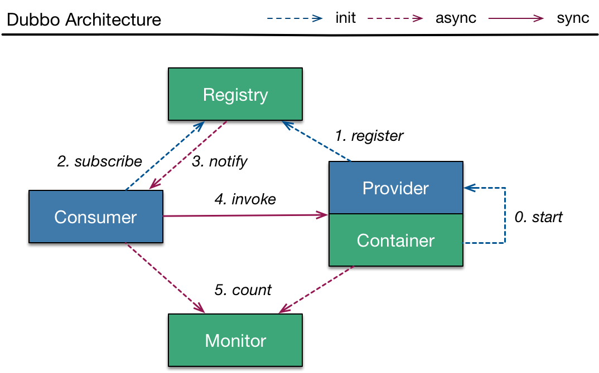

节点角色说明：

调用关系说明：

1. 服务容器负责启动，加载，运行服务提供者。

2. 服务提供者在启动时，向注册中心注册自己提供的服务。

3. 服务消费者在启动时，向注册中心订阅自己所需的服务。

4. 注册中心返回服务提供者地址列表给消费者，如果有变更，注册中心将基于长连接推送变更数据给消费者。

5. 服务消费者，从提供者地址列表中，基于软负载均衡算法，选一台提供者进行调用，如果调用失败，再选另一台调用。

6. 服务消费者和提供者，在内存中累计调用次数和调用时间，定时每分钟发送一次统计数据到监控中心。

**Dubbo总体架构**

Dubbo框架设计共划分了10层，最上面的Service层是留给实际使用Dubbo开发分布式服务的开发者实现业务逻辑的接口层。图中左边淡蓝背景的为服务消费方使用的接口，右边淡绿色背景的为服务提供方使用的接口，位于中轴线上的为双方都用到的接口。

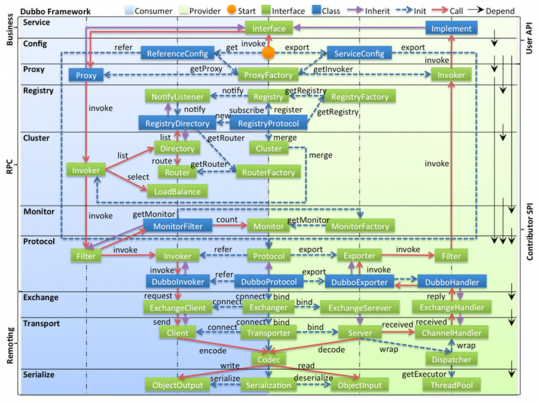

各层说明：

l Config 配置层：对外配置接口，以 ServiceConfig, ReferenceConfig 为中心，可以直接初始化配置类，也可以通过 spring 解析配置生成配置类。

l Proxy 服务代理层：服务接口透明代理，生成服务的客户端 Stub 和服务器端 Skeleton, 以 ServiceProxy 为中心，扩展接口为 ProxyFactory。

l Registry 注册中心层：封装服务地址的注册与发现，以服务 URL 为中心，扩展接口为 RegistryFactory, Registry, RegistryService。

l Cluster 路由层：封装多个提供者的路由及负载均衡，并桥接注册中心，以 Invoker 为中心，扩展接口为 Cluster, Directory, Router, LoadBalance。

l Monitor 监控层：RPC 调用次数和调用时间监控，以 Statistics 为中心，扩展接口为 MonitorFactory, Monitor, MonitorService。

l Protocol 远程调用层：封将 RPC 调用，以 Invocation, Result 为中心，扩展接口为 Protocol, Invoker, Exporter。

l Exchange 信息交换层：封装请求响应模式，同步转异步，以 Request, Response 为中心，扩展接口为 Exchanger, ExchangeChannel, ExchangeClient, ExchangeServer。

l Transport 网络传输层：抽象 mina 和 netty 为统一接口，以 Message 为中心，扩展接口为 Channel, Transporter, Client, Server, Codec。

l Serialize 数据序列化层：可复用的一些工具，扩展接口为 Serialization, ObjectInput, ObjectOutput, ThreadPool。

**模块分包**

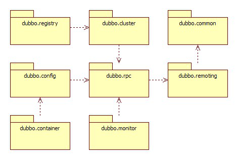

各模块说明：

l dubbo-common公共逻辑模块：包括 Util 类和通用模型。

l dubbo-remoting远程通讯模块：相当于 Dubbo 协议的实现，如果 RPC 用 RMI协议则不需要使用此包。

l dubbo-rpc远程调用模块：抽象各种协议，以及动态代理，只包含一对一的调用，不关心集群的管理。

l dubbo-cluster集群模块：将多个服务提供方伪装为一个提供方，包括：负载均衡, 容错，路由等，集群的地址列表可以是静态配置的，也可以是由注册中心下发。

l dubbo-registry注册中心模块：基于注册中心下发地址的集群方式，以及对各种注册中心的抽象。

l dubbo-monitor监控模块：统计服务调用次数，调用时间的，调用链跟踪的服务。

l dubbo-config配置模块：是 Dubbo 对外的 API，用户通过 Config 使用D ubbo，隐藏 Dubbo 所有细节。

l dubbo-container容器模块：是一个 Standlone 的容器，以简单的 Main 加载 Spring 启动，因为服务通常不需要 Tomcat/JBoss 等 Web 容器的特性，没必要用 Web 容器去加载服务。

**协议支持**

l Dubbo协议（默认协议）

l Hessian协议

l HTTP协议

l RMI协议

l WebService协议

l Thrift协议

l Memcached协议

l Redis协议

**注册中心**

（1）Multicast注册中心：

Multicast注册中心不需要启动任何中心节点，只要广播地址一样，就可以互相发现。组播受网络结构限制，只适合小规模应用或开发阶段使用。组播地址段: 224.0.0.0 - 239.255.255.255。

（2）Zookeeper注册中心（推荐）：

Zookeeper是Apacahe子项目，是一个树型的目录服务，支持变更推送，适合作为Dubbo服务的注册中心，可用于生产环境。

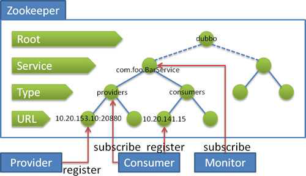

对上图流程说明如下：

1. 服务提供者（Provider）启动时，向/dubbo/com.foo.BarService/providers目录下写入URL。

2. 服务消费者（Consumer）启动时，订阅/dubbo/com.foo.BarService/providers目录下的URL，向/dubbo/com.foo.BarService/consumers目录下写入自己的URL。

3. 监控中心（Monitor）启动时，订阅/dubbo/com.foo.BarService目录下的所有提供者和消费者URL。

（3）Redis注册中心：

阿里内部并没有采用Redis做为注册中心，而是使用自己实现的基于数据库的注册中心，即：Redis注册中心并没有在阿里内部长时间运行的可靠性保障，此Redis桥接实现只为开源版本提供，其可靠性依赖于Redis本身的可靠性。

（4）Simple注册中心：

Simple注册中心本身就是一个普通的Dubbo服务，可以减少第三方依赖，使整体通讯方式一致。只是简单实现，不支持集群，可作为自定义注册中心的参考，但不适合直接用于生产环境。

**远程通信与信息交换**

远程通信需要指定通信双方所约定的协议，在保证通信双方理解协议语义的基础上，还要保证高效、稳定的消息传输。Dubbo继承了当前主流的网络通信框架，主要包括如下几个：

l Mina

l Netty（默认）

l Grizzly

**停止维护**

从2012年10月23日Dubbo 2.5.3发布后，在Dubbo开源将满一周年之际，阿里基本停止了对Dubbo的主要升级。只在之后的2013年和2014年更新过2次对Dubbo 2.4的维护版本，然后停止了所有维护工作。Dubbo对Srping的支持也停留在了Spring 2.5.6版本上。

**分支出现**

在阿里停止维护和升级Dubbo期间，当当网开始维护自己的Dubbo分支版本Dubbox，支持了新版本的Spring，并对外开源了Dubbox。同时，网易考拉也维护了自己的独立分支Dubbok，可惜并未对外开源。

**重获新生**

经过多年漫长的等待，随着微服务的火热兴起，在国内外开发者对阿里不再升级维护Dubbo的吐槽声中，阿里终于开始重新对Dubbo的升级和维护工作。在2017年9月7日，阿里发布了Dubbo的2.5.4版本，距离上一个版本2.5.3发布已经接近快5年时间了。在随后的几个月中，阿里Dubbo开发团队以差不多每月一版本的速度开始快速升级迭代，修补了Dubbo老版本多年来存在的诸多bug，并对Spring等组件的支持进行了全面升级。

**分支合并**

在2018年1月8日，Dubbo 2.6.0版本发布，新版本将之前当当网开源的Dubbo分支Dubbox进行了合并，实现了Dubbo版本的统一整合。

**Dubbo与Spring Cloud**

阿里巴巴负责主导了Dubbo重启维护的研发工程师刘军在接受采访时表示：当前由于RPC协议、注册中心元数据不匹配等问题，在面临微服务基础框架选型时Dubbo与Spring Cloud是只能二选一，这也是为什么大家总是拿Dubbo和Spring Cloud做对比的原因之一。Dubbo之后会积极寻求适配到Spring Cloud生态，比如作为Spring Cloud的二进制通信方案来发挥Dubbo的性能优势，或者Dubbo通过模块化以及对http的支持适配到Spring Cloud。

**未来展望**

2018年1月8日，Dubbo创始人之一梁飞在Dubbo交流群里透露了Dubbo 3.0正在动工的消息。Dubbo 3.0内核与Dubbo 2.0完全不同，但兼容Dubbo 2.0。Dubbo 3.0将以Streaming为内核，不再是Dubbo 时代的RPC，但是RPC会在Dubbo 3.0中变成远程Streaming对接的一种可选形态。Dubbo 3.0将支持可选Service Mesh，多加一层IPC，这主要是为了兼容老系统，而内部则会优先尝试内嵌模式。代理模式Ops可独立升级框架，减少业务侵入，而内嵌模式可以带业务测试、部署节点少、稳定性检测方便。同时，可以将 Dubbo 3.0 启动为独立进程，由dubbo-mesh进行IPC，路由、负载均衡和熔断机制将由独立进程控制。

**总结**

从Dubbo新版本的路线规划上可以看出，新版本的Dubbo在原有服务治理的功能基础上，将全面拥抱微服务和Service Mesh。同时，考虑到在阿里云已经有了Dubbo的商业版本，在未来一段时间内，Dubbo的更新与维护应该不会再长时间中断。在我们进行服务治理以及微服务架构设计时，新版本Dubbo对我们广大开发者来说都将会是一个不错的选择。

 

--------------------------------二--------------------------
**引言**

作为本系列文章的第二篇，本文主要为大家介绍下微服务概念中非常火热的Spring Cloud开发框架。由于网上关于Spring Cloud的文章多如牛毛，为了让大家阅读后能有不一样的收获，因此本文将用一个相对轻松的叙述方式来为大家讲解一下Spring Cloud框架和微服务。虽然不可能通过一篇文章让大家对Spring Cloud做到从“入门到精通到放弃”，但是希望大家通过阅读本文能对Spring Cloud和微服务有一个更加清晰的认识和了解，为后面学习Service Mesh做好一个铺垫。

**Spring Cloud 之“出身名门望族”**

作为当下最火热的微服务框架，Spring Cloud的名字可以说是无人不知、无人不晓，凭借之前Spring Framework的良好群众基础和Cloud这个具有时代感的名字，Spring Cloud一出现便被大家认知。

提到Spring Cloud，便会让人想起刚刚发布了2.0版本的Spring Boot。Spring Boot和Spring Cloud都是出自Pivotal公司，Spring Boot和Spring Cloud虽然火热，但是了解Pivotal公司的人在国内却是不多。实际上Pivotal公司在云计算、大数据、虚拟化等领域都有所建树，这里先给大家简单八卦下Pivotal的情况。

Pivotal公司是由EMC和VMware联合成立的一家公司，GE（通用电气）也对Pivotal进行了股权收购，同时GE也是Pivotal的一个重要大客户。除了Spring Framework、Spring Boot和Spring Cloud之外，我们日常开发中经常使用的Reids、RabbitMQ、Greenplum、Gemfire、Cloud Foundry等，目前都是归属于Pivotal公司的产品。其中Gemfire也是被中国铁路总公司12306使用的分布式内存数据库，也就是说你过年回家买不到火车票，这个锅Pivotal的Gemfire也会跟着一起背（开个小玩笑，哈哈）。

**Spring Cloud 之“入门”**

Spring Cloud作为一个微服务的开发框架，其包括了很多的组件，包括：Spring Cloud Netflix（Eureka、Hystrix、Zuul、Archaius）、Spring Cloud Config、Spring Cloud Bus、Spring Cloud Cluster、Spring Cloud Consul、Spring Cloud Security、Spring Cloud Sleuth、Spring Cloud Data Flow、Spring Cloud Stream、Spring Cloud Task、Spring Cloud Zookeeper、Spring Cloud Connectors、Spring Cloud Starters、Spring Cloud CLI等。

在上述组件中，Spring Cloud Netflix是一套微服务的核心框架，由互联网流媒体播放商Netflix开源后并入Spring Cloud大家庭，它提供了的微服务最基础的功能：服务发现（Service Discovery）、动态路由（Dynamic Routing）、负载均衡（Load Balancing），和边缘服务器（Edge Server）等。

Spring Boot是Spring的一套快速配置脚手架，可以基于Spring Boot快速开发单个微服务。Spring Boot简化了基于Spring的应用开发，通过少量的代码就能创建一个独立的、生产级别的Spring应用。由于Spring Cloud是基于Spring Boot进行的开发，因此使用Spring Cloud就必须使用到Spring Boot。

下图是一个常见的关于Spring Cloud的架构图。下面此图为例，对Spring Cloud最常用的几个组件做一个简单的介绍：

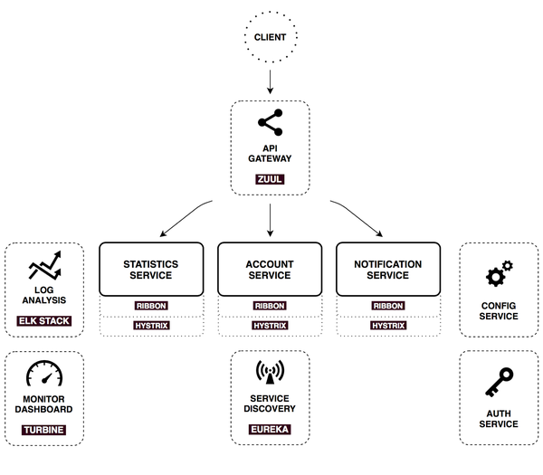

l Eureka：服务注册中心，一个基于REST的服务，用于定位服务，以实现微服务架构中服务发现和故障转移。

l Hystrix：熔断器，容错管理工具，旨在通过熔断机制控制服务和第三方库的节点,从而对延迟和故障提供更强大的容错能力。

l Turbine：Turbine是聚合服务器发送事件流数据的一个工具，用来监控集群下Hystrix的Metrics情况。

l Zuul：API网关，Zuul是在微服务中提供动态路由、监控、弹性、安全等边缘服务的框架。

l Ribbon：提供微服务中的负载均衡功能，有多种负载均衡策略可供选择，可配合服务发现和断路器使用。

l Feign：Feign是一种声明式、模板化的HTTP客户端。

l Spring Cloud Config：配置管理工具包，让你可以把配置放到远程服务器，集中化管理集群配置，目前支持本地存储、Git以及Subversion。

l Spring Cloud Security：基于Spring Security的安全工具包，为微服务的应用程序添加安全控制。

l Spring Cloud Sleuth：日志收集工具包，封装了Dapper和log-based追踪以及Zipkin和HTrace操作，为SpringCloud应用实现了一种分布式追踪解决方案。

除了上面介绍的基础组件外，常见的Spring Cloud组件还有非常多种，涉及到了微服务以及应用开发的方方面面：

l Spring Cloud Starters：Spring Boot式的启动项目，为Spring Cloud提供开箱即用的依赖管理。

l Archaius：配置管理API，包含一系列配置管理API，提供动态类型化属性、线程安全配置操作、轮询框架、回调机制等功能。

l Consul：封装了Consul操作，Consul是一个服务发现与配置工具，与Docker容器可以无缝集成。

l Spring Cloud Stream：数据流操作开发包，封装了与Redis,Rabbit、Kafka等发送接收消息。

l Spring Cloud CLI：基于 Spring Boot CLI，可以让你以命令行方式快速建立云组件。

l Spring Cloud Task：提供云端计划任务管理、任务调度。

l Spring Cloud Bus：事件、消息总线，用于在集群（例如，配置变化事件）中传播状态变化，可与Spring Cloud Config联合实现热部署。

l Spring Cloud Data Flow：大数据操作工具，作为Spring XD的替代产品，它是一个混合计算模型，结合了流数据与批量数据的处理方式。

l Spring Cloud Zookeeper：操作Zookeeper的工具包，用于使用zookeeper方式的服务发现和配置管理。

l Spring Cloud Connectors：便于云端应用程序在各种PaaS平台连接到后端，如：数据库和消息代理服务。

**Spring Cloud 之“精通”**

Spring Cloud虽然集成了众多组件，可以构建一个完整的微服务应用，但是其中的各个组件却并非完美无缺，很多组件在实际应用中都存在诸多不足和缺陷。因此，需要我们对其中的一些组件进行替换和修改，方能构建一个强大、灵活、健壮的微服务架构应用。

l 配置中心：

Spring Cloud Config可以说是Spring Cloud家族中实现最Low的一个组件，直接采用了本地存储/SVN/Git的方式进行存储。同时，Spring Cloud Config也缺乏一个完整的可视化管理查询后台，当存在比较复杂的权限管理和版本管理需求时，Spring Cloud Config会显得非常力不从心。如果需要在配置修改后，能自动进行配置信息推送的话，使用Spring Cloud Config也无法满足要求，需要自行编写代码进行实现。

目前开源社区中，已经有了很多的开源配置中心实现方案，同时很多公司也自研了自己的配置中心方案。包括淘宝的统一配置中心Diamond（已经多年未更新）、百度的分布式配置管理平台Disconf、携程的开源分布式配置中心Apollo、360的分布式配置管理工具QConf等等。目前，笔者公司采用的是自己公司自研的配置中心，没有采用开源实现的主要原因是因为需要同时适配Spring Cloud和Dubbo等多种场景的应用。

l 注册中心

作为Spring Cloud的服务注册中心，从分布式CAP理论来看，Eureka采用是AP型设计，强调的是注册中心的高可用性。和Dubbo常用的服务注册中心Zookeeper相比，Zookeeper则是采用的CP型设计，强调的是注册中心数据的一致性。

Eureka的设计确实简单易用，但是默认没有实现对注册中心数据的持久化。同时，在极端场景下，也会出现多个Eureka注册中心节点数据不一致，甚至服务注册数据丢失的情况。当然，从分布式CAP理论来看，理论上是没办法做到同时兼顾CAP三点的。目前也有一些互联网公司对Eureka进行了改造，支持了数据的持久化，但是尚不能完整的支持CAP的全部要求。

l API网关

API网关可以说是微服务需求最多，也是最有难点的一个组件。Spring Cloud中集成的Zuul应该说更多的是实现了服务的路由功能，对于负载均衡等其他功能，需要结合Ribbon等组件来实现。对于很多个性化的需求，需要开发者自己来进行编码实现。

和大部分基于Java的Web应用类似，Zuul也采用了Servlet架构，因此Zuul处理每个请求的方式是针对每个请求是用一个线程来处理。同时，由于Zuul是基于JVM的实现，因此性能也会在高并发访问场景下成为瓶颈。虽然网上一些文章评测Zuul和Nginx性能接近，但是在性能要求较高的场景下，JVM的内存管理和垃圾回收问题，仍然是一个很大的问题。所以在实际的应用场景中，通常会采用在多个Zuul几点前面再添加一层Nginx或者OpenResty来进行代理。

为了解决Zuul的性能问题，Netflix将自己的网关服务Zuul进行了升级，新的Zuul 2将HTTP请求的处理方式从同步变成了异步，并且新增诸如HTTP/2、websocket等功能。但是遗憾的是，开源版本的Zuul 2一直处于难产状态中，始终没有和大家正式见面。

l 熔断器

微服务中对于服务的限流、降级、熔断的需求是多种多样的，需要在API网关和各个具体服务接口中分别进行控制，才能满足复杂场景下微服务架构的应用需求。

单独使用Spring Cloud中的Hystrix无法完整的满足上述的复杂需求，需要结合API网关，并通过Kubernetes对资源、进程和命名空间来提供隔离，并通过部分自定义编码方能实现对全部服务的限流、降级、熔断等需求。

l 监控系统

无论是Spring Cloud中集成的Spring Cloud Sleuth，还是集成经典的ELK，都只是对日志级别的追踪和监控。在大中型微服务应用架构中，尤其是基于JVM的项目，还需要添加APM的监控机制，才能保证及时发现各种潜在的性能问题。

APM整体上主要完成3点功能：1.日志追踪、2.监控报警、3.性能统计。目前，国内外商业版本的APM方案已经有很多，开源版本的APM方案也开始丰富起来。国内开源的APM方案主要有：大众点评的CAT和Apache孵化中的SkyWalking。这里给大家重点推荐下SkyWalking，SkyWalking是针对分布式系统的应用性能监控系统，特别针对微服务、Cloud Native和容器化(Docker, Kubernetes, Mesos)架构，项目的关注度和发展速度都很快，中文文档资料也比较齐全。

**Spring Cloud 之“放弃”**

Spring Cloud可以说是一个完美的微服务入门框架，如果你是在一个中小型项目中应用Spring Cloud，那么你不需要太多的改造和适配，就可以实现微服务的基本功能。但是如果是在大型项目中实践微服务，可能会发现需要处理的问题还是比较多，尤其是项目中老代码比较多，没办法全部直接升级到Spring Boot框架下开发的话，你会非常希望能有一个侵入性更低的方案来实施微服务架构。在这种场景下，Service Mesh将会成为你的最佳选择，经过一段时间的发展，目前Service Mesh这个概念已经开始逐步被大家了解和认知。同时，一些Service Mesh的实现方案也逐步成熟和落地，例如Istio、Linkerd、Envoy等。在本系列文章的下一篇中，将为大家对Service Mesh概念做一个系统的介绍。但是在了解Service Mesh概念之前，还是建议大家先对微服务和Spring Cloud这些概念和框架有一个深入的了解，这样才能体会到应用Service Mesh的价值和意义。

**Spring Cloud 与Dubbo**

网上关于Spring Cloud和Dubbo对比的文章很多，大多数对比结果都是Spring Cloud压倒性优势战胜Dubbo，下表是对Dubbo和Spring Cloud做的一个基础功能的对比：

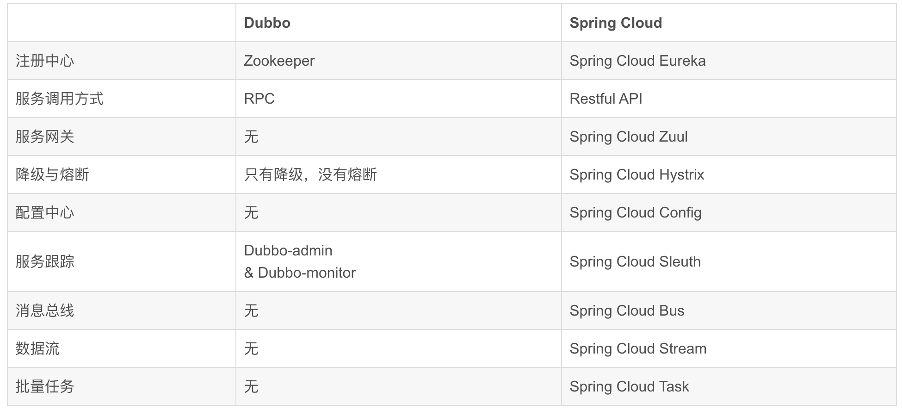 

实际上，Dubbo的关注点在于服务治理，并不能算是一个真正的微服务框架。包括目前在开发中的Dubbo 3.0，也不能完整覆盖微服务的各项功能需求。而Spring Cloud一方面是针对微服务而设计，另外一方面Spring Cloud是通过集成各种组件的方式来实现微服务，因此理论上可以集成目前业内的绝大多数的微服务相关组件，从而实现微服务的全部功能。

而对Dubbo而言，如果一定要应用到微服务的使用场景中的话，上表中欠缺的大多数功能都可以通过集成第三方应用和组件的方式来实现，跟Spring Cloud相比主要的缺陷在于集成过程中的便利性和兼容性等问题。

**Spring Cloud 与Docker**

虽然网上也有很多文章写到如何使用Docker来实现微服务，但是事实上单独使用Docker是没办法完整的实现微服务的所有功能的。在实际上微服务架构中，Spring Cloud和Docker更多的是一种协作的关系，而不是一种竞争的关系。通过Docker容器化技术，可以更好的解决引入Spring Cloud微服务后带来的部署和运维的复杂性。

Spring Cloud生态圈中的Pivotal Cloud Foundry (PCF)作为 PAAS 实现，也提供一些类似于Docker的功能支持，但是无论上功能上还是易用性上和Docker还是存在比较大的差异。Pivotal Cloud Foundry和Docker之间的关系更多的是一种兼容关系，而不是竞争关系，Pivotal Cloud Foundry的主要竞争对手是Red Hat的OpenShift。目前，Pivotal Cloud Foundry支持的IAAS包括：AWS、AZURE、GCP、vSphere、OpenStack等。

**Spring Cloud 与Kubernetes**

网上也有一些“Spring Cloud与Kubernetes哪个更好”，“当已经有了Kubernetes之后，还需要使用Spring Cloud么”之类的文章。首先说笔者并不认为Spring Cloud与Kubernetes是竞争关系，但是也不否认二者确实在诸多功能上存在一些重合。下图是对Spring Cloud与Kubernetes在微服务架构中的一些基础功能上的对比。

 
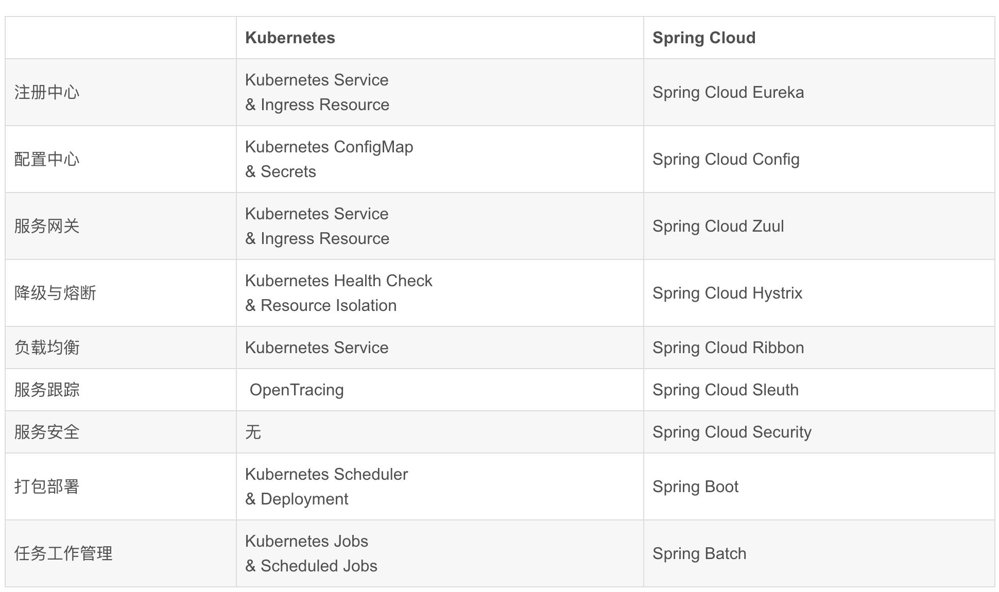

通过对比可以看出，Spring Cloud和Kubernetes确实存在一些功能上的重合，但是二者的定位其实差别很大。Spring Cloud是一个基于Java语言的微服务开发框架，而Kubernetes是一个针对容器应用的自动化部署、伸缩和管理的开源系统，它兼容多种语言且提供了创建、运行、伸缩以及管理分布式系统的原语。Spring Cloud更多的是面向有Spring开发经验的Java语言开发者，而Kubernetes不是一个针对开发者的平台，它的目的是供有DevOps思想的IT人员使用。

为了区分Spring Cloud和Kubernetes两个项目的范围，下面这张图列出了几乎是端到端的微服务架构需求，从最底层的硬件，到最上层的DevOps和自服务经验，并且列出了如何关联到Spring Cloud和Kubernetes平台。

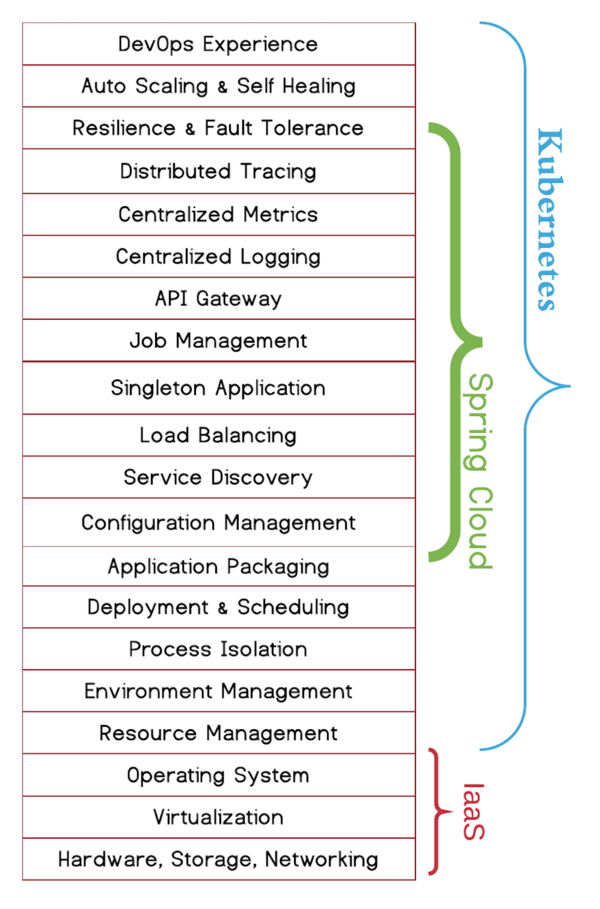

**总结**

通过Spring Cloud、Docker和Kubernetes的组合，可以构建更加完整和强大的微服务架构程序。通过三者的整合，使用Spring Boot提供应用的打包，Docker和Kubernetes提供应用的部署和调度。Spring Cloud通过Hystrix线程池提供应用内的隔离，而Kubernetes通过资源、进程和命名空间来提供隔离。Spring Cloud为每个微服务提供健康终端，而Kubernetes执行健康检查，且把流量导到健康服务。Spring Cloud外部化配置并更新它们，而Kubernetes分发配置到每个微服务。

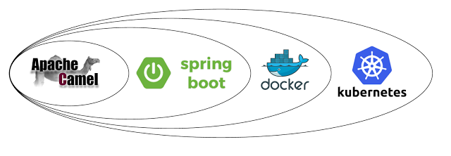

对于一名开发人员或者架构师来说，想要精通微服务设计与开发，能够在大中型项目中应用微服务架构，单纯掌握Spring Cloud是远远不够的，Docker和Kubernetes等都是需要学习和掌握的内容。同时，由于采用微服务架构后带来了分布式的相关问题，对于分布式系统理论也必须有一定的了解。当然，最重要的还是对系统业务的深入理解，对整体业务进行合理的规划和拆分，才能真正行之有效的应用微服务架构，构建高效、健壮、灵活、可扩展的微服务应用。

----------------------三-----------------------------
**引言**

作为本系列文章的第三篇，本文主要为大家介绍下当前非常火热的Service Mesh概念，最后也会简单介绍一下目前同样非常热门的Serverless概念。Service Mesh目前比较多的翻译为“服务网格”，也有翻译为“服务啮合”。很多人将之称为下一代微服务，或直接称之为微服务2.0。前两篇文章中介绍的Dubbo和Spring Cloud实际上距离真正意义上的微服务还有一定的距离，本文将带你了解在微服务2.0时代，Service Mesh方式是如何实现下一代微服务标准的，并介绍当前比较常见的几种Service Mesh实现方案。

**微服务1.0时代**

Dubbo本质上只能算是一个服务治理框架，而不能算是一个微服务框架。虽然在未来的Dubbo 3.0中会提供对Spring Cloud，以及对Service Mesh的支持，但是单凭Dubbo仍然是无法搭建一个完整的微服务体系结构。

Spring Cloud则是通过集成众多的组件的形式实现了相对完整的微服务技术栈，但是Spring Cloud的实现方式代码侵入性较强，而且只支持Java语言，无法支持其他语言开发的系统。Spring Cloud全家桶包括的内容较多，学习成本也相对较高，对老系统而言，框架升级或者替换的成本较高，导致一些开发团队不愿意担负技术和时间上的风险与成本，使得微服务方案在落地时遇到了诸多的困难。

总结一下，微服务1.0时代的主要问题主要包括如下三方面：

技术门槛高：开发团队在实施微服务的过程中，除了基础的服务发现、配置中心和鉴权管理之外，团队在服务治理层面面临了诸多的挑战，包括负载均衡、熔断降级、灰度发布、故障切换、分布式跟踪等，这对开发团队提出了非常高的技术要求。
多语言支持不足：对于互联网公司，尤其是快速发展的互联网创业公司，多语言的技术栈、跨语言的服务调用也是常态，但目前开源社区上并没有一套统一的、跨语言的微服务技术栈，而跨语言调用恰恰是微服务概念诞生之初的要实现的一个重要特性之一。
代码侵入性强：Spring Cloud、Dubbo等主流的微服务框架都对业务代码有一定的侵入性，技术升级替换成本高，导致开发团队配合意愿低，微服务落地困难。

**微服务2.0时代**

为了解决微服务1.0时代的诸多问题，Service Mesh概念开始走入了开发者的视线中。

在介绍Service Mesh概念之前，我们先来了解一下Sidecar。Sidecar是以第一次世界大战时活跃在战场上的军用边斗车命名（也是我们在抗日神剧中最常见的道具之一）。Sidecar是Service Mesh中的重要组成部分，Sidecar在软件系统架构中特指边斗车模式，这个模式的精髓在于实现了数据面（业务逻辑）和控制面的解耦。

在Service Mesh架构中，给每一个微服务实例部署一个Sidecar Proxy。该Sidecar
Proxy负责接管对应服务的入流量和出流量，并将微服务架构中的服务订阅、服务发现、熔断、限流、降级、分布式跟踪等功能从服务中抽离到该Proxy中。

Sidecar以一个独立的进程启动，可以每台宿主机共用同一个Sidecar进程，也可以每个应用独占一个Sidecar进程。所有的服务治理功能，都由Sidecar接管，应用的对外访问仅需要访问Sidecar即可。当该Sidecar在微服务中大量部署时，这些Sidecar节点自然就形成了一个服务网格。

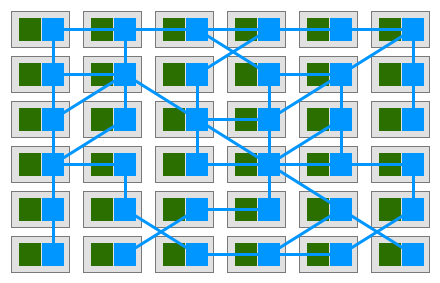

微服务的概念在2014年3月由Martin Fowler首次提出，而Service Mesh的概念则是在2016年左右提出，Service Mesh至今也经历了第二代的发展。

第一代Service Mesh的代表为Linkerd和Envoy。Linkerd基于Twitter的Fingle，使用Scala编写，是业界第一个开源的Service Mesh方案，在长期的实际生产环境中获得验证。Envoy底层基于C++，性能上优于使用Scala的Linkrd。同时，Envoy社区成熟度较高，商用稳定版本面世时间也较长。这两个开源实现都是以Sidecar为核心，绝大部分关注点都是如何做好Proxy，并完成一些通用控制面的功能。但是当你在容器中大量部署Sidecar以后，如何管理和控制这些Sidecar本身就是一个不小的挑战。

第二代Service Mesh主要改进集中在更加强大的控制面功能（与之对应的Sidecar Proxy被称之为数据面），典型代表有Istio和Conduit。Istio是Google、IBM和Lyft合作的开源项目，是目前最主流的Service Mesh方案，也是事实上的第二代Service Mesh标准。在Istio中，直接把Envoy作为Sidecar。除了Sidecar，Istio中的控制面组件都是使用Go语言编写。

**Istio简介**

根据Istio官方文档的介绍，Istio在服务网络中主要提供了以下关键功能：

- 流量管理：控制服务之间的流量和API调用的流向，使得调用更可靠，并使网络在恶劣情况下更加健壮。
- 可观察性：了解服务之间的依赖关系，以及它们之间流量的本质和流向，从而提供快速识别问题的能力。
- 策略执行：将组织策略应用于服务之间的互动，确保访问策略得以执行，资源在消费者之间良好分配。策略的更改是通过配置网格而不是修改应用程序代码。
- 服务身份和安全：为网格中的服务提供可验证身份，并提供保护服务流量的能力，使其可以在不同可信度的网络上流转。
- 平台支持：Istio旨在在各种环境中运行，包括跨云、Kubernetes、Mesos等。最初专注于Kubernetes，但很快将支持其他环境。
- 集成和定制：策略执行组件可以扩展和定制，以便与现有的ACL、日志、监控、配额、审核等解决方案集成。

Istio针对可扩展性进行了设计，以满足不同的部署需要。这些功能极大的减少了应用程序代码、底层平台和策略之间的耦合，使得微服务更加容易实现。

下图为Istio的架构设计图，主要包括了Envoy、Pilot、Mixer和Istio-Auth等。

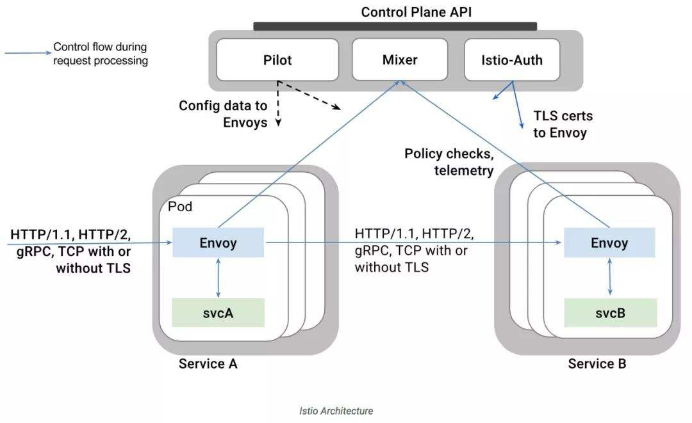

- Envoy: 扮演Sidecar的功能，协调服务网格中所有服务的出入站流量，并提供服务发现、负载均衡、限流熔断等能力，还可以收集与流量相关的性能指标。
- Pilot: 负责部署在Service Mesh中的Envoy实例的生命周期管理。本质上是负责流量管理和控制，将流量和基础设施扩展解耦，这是Istio的核心。可以把Pilot看做是管理Sidecar的Sidecar, 但是这个特殊的Sidacar并不承载任何业务流量。Pilot让运维人员通过Pilot指定它们希望流量遵循什么规则，而不是哪些特定的pod/VM应该接收流量。有了Pilot这个组件，我们可以非常容易的实现 A/B 测试和金丝雀Canary测试。
- Mixer: Mixer在应用程序代码和基础架构后端之间提供通用中介层。它的设计将策略决策移出应用层，用运维人员能够控制的配置取而代之。应用程序代码不再将应用程序代码与特定后端集成在一起，而是与Mixer进行相当简单的集成，然后Mixer负责与后端系统连接。Mixer可以认为是其他后端基础设施（如数据库、监控、日志、配额等）的Sidecar Proxy。
- Istio-Auth: 提供强大的服务间认证和终端用户认证，使用交互TLS，内置身份和证书管理。可以升级服务网格中的未加密流量，并为运维人员提供基于服务身份而不是网络控制来执行策略的能力。Istio的未来版本将增加细粒度的访问控制和审计，以使用各种访问控制机制（包括基于属性和角色的访问控制以及授权钩子）来控制和监视访问服务、API或资源的访问者。

Istio的设计理念先进，功能也比较强大，加之Google、IBM的影响力让Istio迅速传播，让广大开发者认识到了Istio项目在Service Mesh领域的重要性。但是Istio目前版本也存在了一些不足：

- 目前的Istio大部分能力与Kubernetes是强关联的。而我们在构建微服务的时候往往是希望服务层与容器层是解耦的，服务层在设计上需要能够对接多种容器层平台。
- Istio至今未有稳定版本，截至本文编写时为止，Istio的最新版本为0.8版本，预计在2018年内会发布1.0版本。

**Conduit简介**

我们再来看一下Conduit的实现，下图是Conduit的架构设计图，其中重点由Conduit Data Plane和Conduit Control Plane两部分组成：

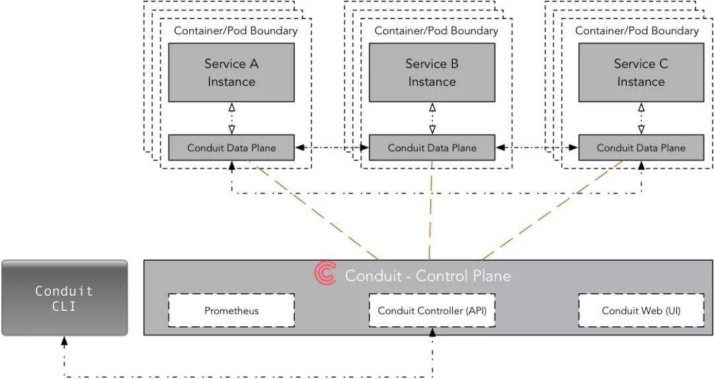

Conduit各方面的设计理念与Istio非常类似，作者使用Rust语言重新编写了Sidecar, 叫做Conduit Data Plane, 控制面则由Go语言编写的Conduit Control Plane接管。从Conduit的架构看，作者号称Conduit吸取了很多Linkerd的教训，比Linkerd更快、更轻、更简单，控制面功能更强。与Istio比较，Conduit的架构一方面比较简单，另一方面对于要解决的问题足够聚焦。

**Serverless简介**

Serverless被翻译为“无服务器架构”，这个概念在2012年时便已经存在，比微服务和Service Mesh的概念出现都要早，但是直到微服务概念大红大紫之后，Serverless才重新又被人们所关注。

Serverless（无服务器架构）并不意味着没有任何服务器去运行代码，Serverless是无需管理服务器，只需要关注代码，而提供者将处理其余部分工作。“无服务器架构”也可以指部分服务器端逻辑依然由应用程序开发者来编写的应用程序，但与传统架构的不同之处在于，这些逻辑运行在完全由第三方管理，由事件触发的无状态（Stateless）暂存于计算容器内。

对于开发者来说，Serverless架构可以将其服务器端应用程序分解成多个执行不同任务的函数，整个应用分为几个独立、松散耦合的组件，这些组件可以在任何规模上运行。

下图为一种常见的Serverless架构图，所有的服务都以FaaS（函数即服务）的方式对外进行提供。在语言和环境方面，FaaS 函数就是常规的应用程序，例如使用JavaScript、Python以及 Java等语言实现。

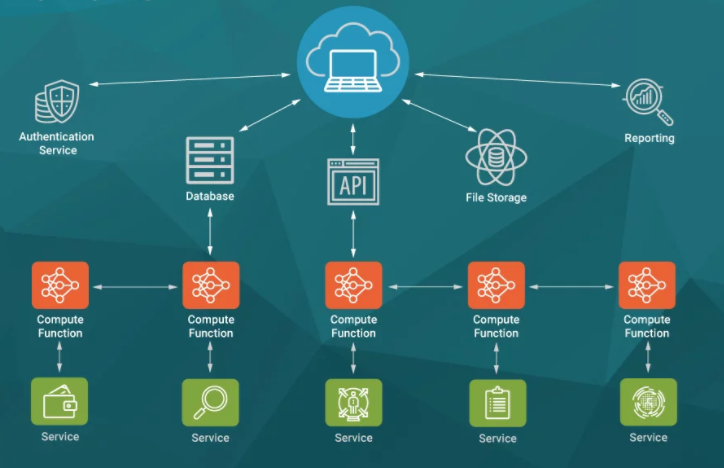

**Serverless架构优势**

- 缩短交付时间：Serverless架构允许开发人员在极短时间内（几小时、几天）交付新的应用程序，而不是像以前一样需要几个星期或几个月。在新的应用程序中，依赖于第三方API提供服务的例子很多，如认证(OAuth)、社交、地图、人工智能等。
- 增强可伸缩性：所有人都希望自己开发的应用能够快速获取大量的新增用户，但是当活跃用户快速增长的时候，服务器的压力也会激增。使用Serverless架构的体系不再有上述担忧，可以及时、灵活进行扩展来应对快速增长的活跃用户带来的访问压力。
- 降低成本：Serverless架构模式可以降低计算能力和人力资源方面的成本，如果不需要服务器，就不用花费时间重新造轮子、风险监测、图像处理，以及基础设施管理，操作成本会直线下降。
- 改善用户体验：用户通常不太关心基础设施，而更注重于功能和用户体验。Serverless架构允许团队将资源集中在用户体验上。
- 减少延迟及优化地理位置信息：应用规模能力取决于三个方面：用户数量、所在位置及网络延迟。当应用要面向全国甚至全球用户的时候，通常会产生较高的延迟，从而降低用户体验。在Serverless架构下，供应商在每个用户附近都有节点，大幅度降低了访问延迟，因此所有用户的体验都可以得到提升。

**总结**

对于大规模部署微服务，内部服务异构程度高的场景，使用Service Mesh方案是一个不错的选择。Service Mesh实现了业务逻辑和控制的解耦，但是也带来了额外的开销，由于网络中多了一跳，增加了性能的损耗和访问的延迟。同时，由于每个服务都需要部署Sidecar, 这也会使本来就具有一定复杂度的分布式系统变得更加复杂。尤其是在实施初期，对Service Mesh的管理和运维会是一个棘手的问题。因此，当我们选择使用Service Mesh架构的时候，需要对具体的Service Mesh实现方案（例如：Istio）做好充分的技术准备和经验积累工作，方能确保方案的顺利实施。

在微服务与容器技术火热之后，Serverless（无服务器架构）成为新的热点，无服务器云函数可以让用户无需关心服务器的部署运营，只需开发最核心的业务逻辑，即可实现上线运营，具备分布容灾能力，可以依据负载自动扩缩容，并按照实际调用次数与时长计费。

使用Serverless架构可以免除所有运维性操作，开发人员可以更加专注于核心业务的开发，实现快速上线和迭代，把握业务发展的节奏。Serverless架构可以认为是对微服务和容器化的一种补充，为用户提供了一种新的选择，来应对复杂多变的需求，尤其适合快速发展的初创型公司。

