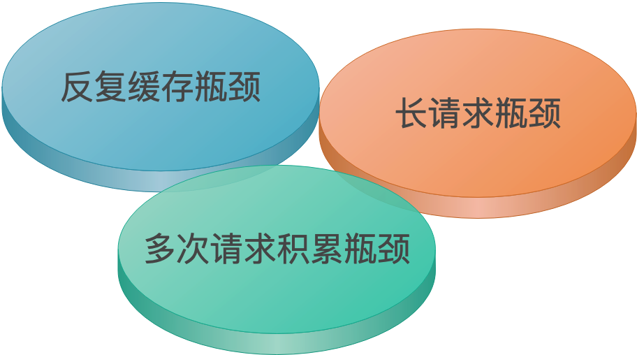
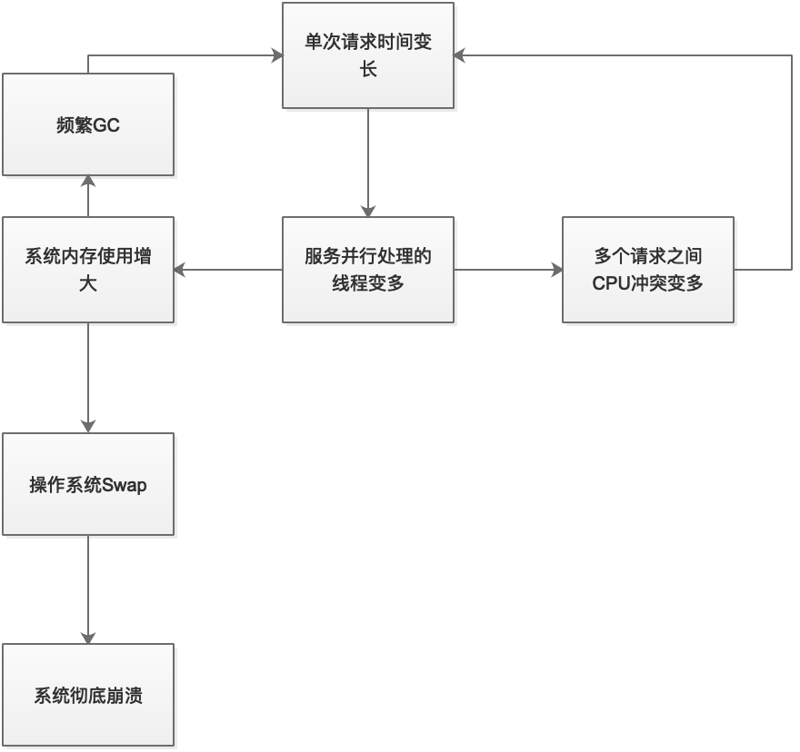
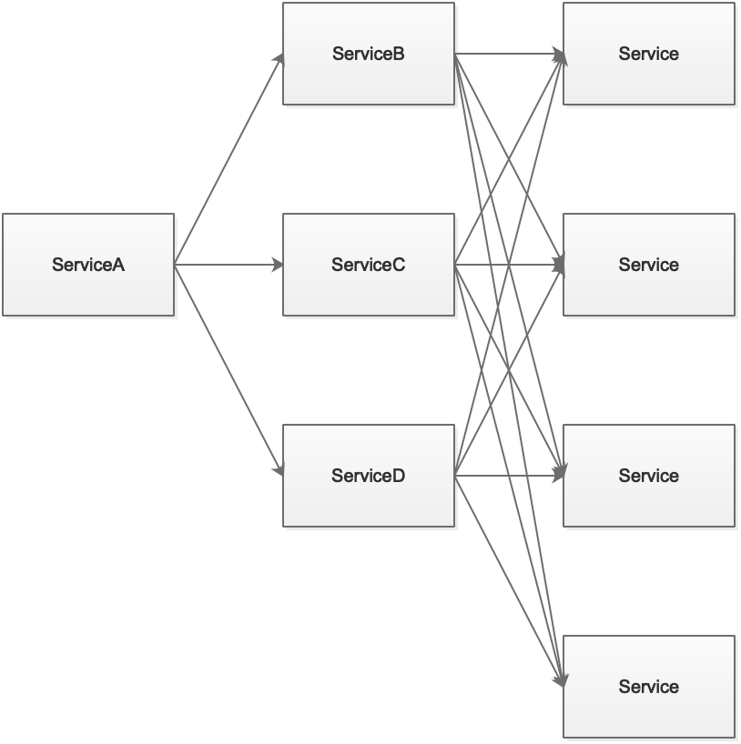
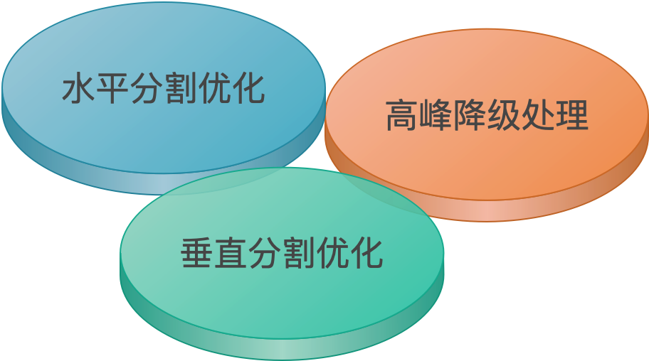
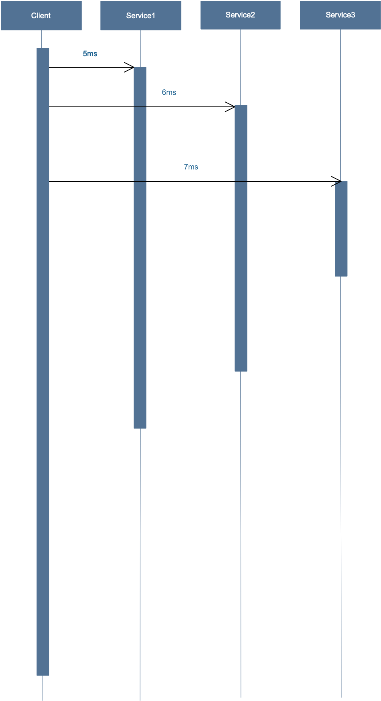

## 解答

在高并发大量用户的场景，系统一般会面临如下三个挑战：
1. 日益增长的用户数量

2. 日渐复杂的业务

3. 急剧膨胀的数据

这些挑战对于性能优化而言表现为：在保持和降低系统TP95响应时间（指的是将一段时间内的请求响应时间从低到高排序，高于95%请求响应时间的下确界）的前提下，不断提高系统吞吐量，提升流量高峰时期的服务可用性。

本文主要目标是为类似的场景提供优化方案，确保系统在流量高峰时期的快速响应和高可用。

### 性能瓶颈场景
在讲解如何性能优化之前，有必要先了解下性能瓶颈在哪里，以下我们先从瓶颈（各种性能堵塞场景）讲起，明确问题所在，然后我们再根据瓶颈，来看如何来解决方案。

### 1.长请求拥塞瓶颈

这是一种单次请求时延变长而导致系统性能恶化甚至崩溃的恶化模式。

对于多线程服务，大量请求时间变长会使线程堆积、内存使用增加，最终可能会通过如下三种方式之一恶化系统性能：

    线程数目变多导致线程之间CPU资源使用冲突，反过来进一步延长了单次请求时间；
    线程数量增多以及线程中缓存变大，内存消耗随之剧增，对于基于Java语言的服务而言，又会更频繁地full GC，反过来单次请求时间会变得更长；
    内存使用增多，会使操作系统内存不足，必须使用Swap，可能导致服务彻底崩溃。
典型恶化流程图如下图：

长请求拥塞反模式所导致的性能恶化现象非常普遍，所以识别该模式非常重要。

典型的场景如下：某复杂业务系统依赖于多个服务，其中某个服务的响应时间变长，随之系统整体响应时间变长，进而出现CPU、内存、Swap报警，在分布式环境下，从而引起连锁反应，最后造成雪崩的情况。阿里P8架构师谈：什么是缓存雪崩？服务器雪崩的场景与解决方案

系统进入长请求拥塞反模式的典型标识包括：被依赖服务可用性变低、响应时间变长、服务的某段计算逻辑时间变长等。

### 2.多次请求杠杆造成性能瓶颈

客户端一次用户点击行为往往会触发多次服务端请求，这是一次请求杠杆。

每个服务端请求进而触发多个更底层服务的请求，这是第二次请求杠杆。每一层请求可能导致一次请求杠杆，请求层级越多，杠杆效应就越大。

在多次请求杠杆反模式下运行的分布式系统，处于深层次的服务需要处理大量请求，容易会成为系统瓶颈。

与此同时，大量请求也会给网络带来巨大压力，特别是对于单次请求数据量很大的情况，网络可能会成为系统彻底崩溃的导火索。典型恶化流程图如下图：

多次请求杠杆所导致的性能恶化现象非常常见。

例如：对于推荐系统，一个用户列表请求会有多个算法参与，每个算法会召回多个列表单元（商家或者团购），每个列表单元有多种属性和特征，而这些属性和特征数据服务又分布在不同服务和机器上面，所以客户端的一次用户展现可能导致了成千上万的最底层服务调用。

对于存在多次请求杠杆反模式的分布式系统，性能恶化与流量之间往往遵循指数曲线关系。这意味着，在平常流量下正常运行服务系统，在流量高峰时通过线性增加机器解决不了可用性问题。所以，识别并避免系统进入多次请求杠杆反模式对于提高系统可用性而言非常关键。

### 3.反复缓存造成性能瓶颈

为了降低响应时间，系统往往在本地内存中缓存很多数据。缓存数据越多，命中率就越高，平均响应时间就越快。为了降低平均响应时间，有些开发者会不加限制地缓存各种数据，在正常流量情况下，系统响应时间和吞吐量都有很大改进。

但是当流量高峰来临时，系统内存使用开始增多，触发了JVM进行full GC，进而导致大量缓存被释放（因为主流Java内存缓存都采用SoftReference和WeakReference所导致的），而大量请求又使得缓存被迅速填满，这就是反复缓存。反复缓存导致了频繁的full GC，而频繁full GC往往会导致系统性能急剧恶化。典型恶化流程图如下图：

反复缓存所导致性能恶化的原因是无节制地使用缓存。缓存使用的指导原则是：工程师们在使用缓存时必须全局考虑，精细规划，确保数据完全缓存的情况下，系统仍然不会频繁full GC。

为了确保这一点，对于存在多种类型缓存以及系统流量变化很大的系统，设计者必须严格控制缓存大小，甚至废除缓存（这是典型为了提高流量高峰时可用性，而降低平均响应时间的一个例子）。

反复缓存反模式往往发生在流量高峰时候，通过线性增加机器和提高机器内存可以大大减少系统崩溃的概率。

## 性能优化方式

### 1.水平分割模式

原理和动机

典型的服务端运行流程包含四个环节：接收请求、获取数据、处理数据、返回结果。在一次请求中，获取数据和处理数据往往多次发生。在完全串行运行的系统里，一次请求总响应时间满足如下公式：

一次请求总耗时=解析请求耗时 + ∑（获取数据耗时+处理数据耗时） + 组装返回结果耗时

大部分耗时长的服务主要时间都花在中间两个环节，即获取数据和处理数据环节。

对于非计算密集性的系统，主要耗时都用在获取数据上面。获取数据主要有三个来源：本地缓存，远程缓存或者数据库，远程服务。三者之中，进行远程数据库访问或远程服务调用相对耗时较长，特别是对于需要进行多次远程调用的系统，串行调用所带来的累加效应会极大地延长单次请求响应时间，这就增大了系统进入长请求拥塞反模式的概率。

如果能够对不同的业务请求并行处理，请求总耗时就会大大降低。例如下图中，Client需要对三个服务进行调用，如果采用顺序调用模式，系统的响应时间为18ms，而采用并行调用只需要7ms。

水平分割模式首先将整个请求流程切分为必须相互依赖的多个Stage，而每个Stage包含相互独立的多种业务处理（包括计算和数据获取）。完成切分之后，水平分割模式串行处理多个Stage，但是在Stage内部并行处理。如此，一次请求总耗时等于各个Stage耗时总和，每个Stage所耗时间等于该Stage内部最长的业务处理时间。

水平分割模式有两个关键优化点：减少Stage数量和降低每个Stage耗时。为了减少Stage数量，需要对一个请求中不同业务之间的依赖关系进行深入分析并进行解耦，将能够并行处理的业务尽可能地放在同一个Stage中，最终将流程分解成无法独立运行的多个Stage。降低单个Stage耗时一般有两种思路：1. 在Stage内部再尝试水平分割（即递归水平分割），2. 对于一些可以放在任意Stage中进行并行处理的流程，将其放在耗时最长的Stage内部进行并行处理，避免耗时较短的Stage被拉长。

水平分割模式不仅可以降低系统平均响应时间，而且可以降低TP95响应时间（这两者有时候相互矛盾，不可兼得）。通过降低平均响应时间和TP95响应时间，水平分割模式往往能够大幅度提高系统吞吐量以及高峰时期系统可用性，并大大降低系统进入长请求拥塞反模式的概率。

具体案例

例如为用户提供高性能的优质个性化列表服务，每一次列表服务请求会有多个算法参与，而每个算法基本上都采用“召回->特征获取->计算”的模式。 在进行性能优化之前，算法之间采用顺序执行的方式。伴随着算法工程师的持续迭代，算法数量越来越多，随之而来的结果就是客户端响应时间越来越长，系统很容易进入长请求拥塞反模式。曾经有一段时间，一旦流量高峰来临，出现整条服务链路的机器CPU、内存报警。在对系统进行分析之后，我们采取了如下三个优化措施，最终使得系统TP95时间降低了一半：

    算法之间并行计算；
    每个算法内部，多次特征获取进行了并行处理；
    在调度线程对工作线程进行调度的时候，耗时最长的线程最先调度，最后处理。
缺点和优点

对成熟系统进行水平切割，意味着对原系统的重大重构，工程师必须对业务和系统非常熟悉，所以要谨慎使用。水平切割主要有两方面的难点：

- 并行计算将原本单一线程的工作分配给多线程处理，提高了系统的复杂度。而多线程所引入的安全问题让系统变得脆弱。与此同时，多线程程序测试很难，因此重构后系统很难与原系统在业务上保持一致。
- 对于一开始就基于单线程处理模式编写的系统，有些流程在逻辑上能够并行处理，但是在代码层次上由于相互引用已经难以分解。所以并行重构意味着对共用代码进行重复撰写，增大系统的整体代码量，违背奥卡姆剃刀原则。
- 对于上面提到的第二点，举例如下：A和B是逻辑可以并行处理的两个流程，基于单线程设计的代码，假定处理完A后再处理B。在编写处理B逻辑代码时候，如果B需要的资源已经在处理A的过程中产生，工程师往往会直接使用A所产生的数据，A和B之间因此出现了紧耦合。并行化需要对它们之间的公共代码进行拆解，这往往需要引入新的抽象，更改原数据结构的可见域。
- 虽然进行代码重构比较复杂，但是水平切割模式非常容易理解，只要熟悉系统的业务，识别出可以并行处理的流程，就能够进行水平切割。有时候，即使少量的并行化也可以显著提高整体性能。

对于新系统而言，如果存在可预见的性能问题，把水平分割模式作为一个重要的设计理念将会大大地提高系统的可用性、降低系统的重构风险。总的来说，虽然存在一些具体实施的难点，水平分割模式是一个非常有效、容易识别和理解的模式。

### 2.垂直分割模式

原理和动机

对于移动互联网节奏的公司，新需求往往是一波接一波。基于代码复用原则，工程师们往往会在一个系统实现大量相似却完全不相干的功能。伴随着功能的增强，系统实际上变得越来越脆弱。这种脆弱可能表现在系统响应时间变长、吞吐量降低或者可用性降低。导致系统脆弱原因主要来自两方面的冲突：资源使用冲突和可用性不一致冲突。

资源使用冲突是导致系统脆弱的一个重要原因。不同业务功能并存于同一个运行系统里面意味着资源共享，同时也意味着资源使用冲突。可能产生冲突的资源包括：CPU、内存、网络、I/O等。

例如：一种业务功能，无论其调用量多么小，都有一些内存开销。对于存在大量缓存的业务功能，业务功能数量的增加会极大地提高内存消耗，从而增大系统进入反复缓存反模式的概率。对于CPU密集型业务，当产生冲突的时候，响应时间会变慢，从而增大了系统进入长请求拥塞反模式的可能性。

不加区别地将不同可用性要求的业务功能放入一个系统里，会导致系统整体可用性变低。当不同业务功能糅合在同一运行系统里面的时候，在运维和机器层面对不同业务的可用性、可靠性进行调配将会变得很困难。但是，在高峰流量导致系统濒临崩溃的时候，最有效的解决手段往往是运维，而最有效手段的失效也就意味着核心业务的可用性降低。

垂直分割思路就是将系统按照不同的业务功能进行分割，主要有两种分割模式：

1.部署垂直分割

部署垂直分割主要是按照可用性要求将系统进行等价分类，不同可用性业务部署在不同机器上，高可用业务单独部署；

2.代码垂直分割。

代码垂直分割就是让不同业务系统不共享代码，彻底解决系统资源使用冲突问题。

缺点和优点

垂直分割主要的缺点主要有两个：

- 增加了维护成本。一方面代码库数量增多提高了开发工程师的维护成本，另一方面，部署集群的变多会增加运维工程师的工作量；
- 代码不共享所导致的重复编码工作。

垂直分割是一个非常简单而又有效的性能优化模式，特别适用于系统已经出现问题而又需要快速解决的场景。部署层次的分割既安全又有效。需要说明的是部署分割和简单意义上的加机器不是一回事，在大部分情况下，即使不增加机器，仅通过部署分割，系统整体吞吐量和可用性都有可能提升。所以就短期而言，这几乎是一个零成本方案。对于代码层次的分割，开发工程师需要在业务承接效率和系统可用性上面做一些折衷考虑。

### 3.降级模式

原理和动机

降级模式是系统性能保障的最后一道防线。理论上讲，不存在绝对没有漏洞的系统，或者说，最好的安全措施就是为处于崩溃状态的系统提供预案。从系统性能优化的角度来讲，不管系统设计地多么完善，总会有一些意料之外的情况会导致系统性能恶化，最终可能导致崩溃，所以对于要求高可用性的服务，在系统设计之初，就必须做好降级设计。根据作者的经验，良好的降级方案应该包含如下措施：

- 在设计阶段，确定系统的开始恶化数值指标（例如：响应时间，内存使用量）；
- 当系统开始恶化时，需要第一时间报警；
- 在收到报警后，或者人工手动控制系统进入降级状态，或者编写一个智能程序让系统自动降级；
- 区分系统所依赖服务的必要性，一般分为：必要服务和可选服务。必要服务在降级状态下需要提供一个快速返回结果的权宜方案（缓存是常见的一种方案），而对于可选服务，在降级时系统果断不调用；
- 在系统远离恶化情况时，需要人工恢复，或者智能程序自动升级。

典型的降级策略有三种：流量降级、效果降级和功能性降级。

流量降级是指当通过主动拒绝处理部分流量的方式让系统正常服务未降级的流量，这会造成部分用户服务不可用；效果降级表现为服务质量的降级，即在流量高峰时期用相对低质量、低延时的服务来替换高质量、高延时的服务，保障所有用户的服务可用性；功能性降级也表现为服务质量的降级，指的是通过减少功能的方式来提高用户的服务可用性。效果降级和功能性降级比较接近，效果降级强调的是主功能服务质量的下降，功能性降级更多强调的是辅助性功能的缺失。

缺点和优点

为了使系统具备降级功能，需要撰写大量的代码，而降级代码往往比正常业务代码更难写，更容易出错。在确定使用降级模式的前提下，工程师需要权衡这三种降级策略的利弊。大多数面向C端的系统倾向于采用效果降级和功能性降级策略，但是有些功能性模块（比如下单功能）是不能进行效果和功能性降级的，只能采用流量降级策略。对于不能接受降级后果的系统，必须要通过其他方式来提高系统的可用性。

总的来说，降级模式是一种设计安全准则，任何高可用性要求的服务，必须要按照降级模式的准则去设计。对于违背这条设计原则的系统，或早或晚，系统总会因为某些问题导致崩溃而降低可用性。不过，降级模式并非不需要成本，也不符合最小可用原则，所以对于处于MVP阶段的系统，或者对于可用性要求不高的系统，降级模式并非必须采纳的原则。

### 4.其他性能优化建议

对于无法采用系统性的模式方式讲解的性能优化手段，给出一些总结性的建议：

- 删除无用代码有时候可以解决性能问题，例如：有些代码已经不再被调用但是可能被初始化，甚至占有大量内存；有些代码虽然在调用但是对于业务而言已经无用，这种调用占用CPU资源。
- 避免跨机房调用，跨机房调用经常成为系统的性能瓶颈，特别是那些伪batch调用（在使用者看起来是一次性调用，但是内部实现采用的是顺序单个调用模式）对系统性能影响往往非常巨大。

