## 基础概念

概述
​ 首先我们要知道什么是XXL-JOB？

​ 官方简介：XXL-JOB是一个分布式任务调度平台，其核心设计目标是开发迅速、学习简单、轻量级、易扩展。现已开放源代码并接入多家公司线上产品线，开箱即用

​ XXL-JOB的有点特性：

    ​ 1、简单：支持通过Web页面对任务进行CRUD操作，操作简单，一分钟上手；
    ​ 2、动态：支持动态修改任务状态、启动/停止任务，以及终止运行中任务，即时生效；
    ​ 3、调度中心HA（中心式）：调度采用中心式设计，“调度中心”自研调度组件并支持集群部署，可保证调度中心HA；
    ​ 4、执行器HA（分布式）：任务分布式执行，任务"执行器"支持集群部署，可保证任务执行HA；
    ​ 5、注册中心: 执行器会周期性自动注册任务, 调度中心将会自动发现注册的任务并触发执行。同时，也支持手动录入执行器地址；
    ​ 6、弹性扩容缩容：一旦有新执行器机器上线或者下线，下次调度时将会重新分配任务；
    ​ 7、路由策略：执行器集群部署时提供丰富的路由策略，包括：第一个、最后一个、轮询、随机、一致性HASH、最不经常使用、最近最久未使用、故障转移、忙碌转移等；
    ​ 8、故障转移：任务路由策略选择"故障转移"情况下，如果执行器集群中某一台机器故障，将会自动Failover切换到一台正常的执行器发送调度请求。
    ​ 9、阻塞处理策略：调度过于密集执行器来不及处理时的处理策略，策略包括：单机串行（默认）、丢弃后续调度、覆盖之前调度；
    ​ 10、任务超时控制：支持自定义任务超时时间，任务运行超时将会主动中断任务；
    ​ 11、任务失败重试：支持自定义任务失败重试次数，当任务失败时将会按照预设的失败重试次数主动进行重试；其中分片任务支持分片粒度的失败重试；
    ​ 12、任务失败告警；默认提供邮件方式失败告警，同时预留扩展接口，可方便的扩展短信、钉钉等告警方式；
    ​ 13、分片广播任务：执行器集群部署时，任务路由策略选择"分片广播"情况下，一次任务调度将会广播触发集群中所有执行器执行一次任务，可根据分片参数开发分片任务；
    ​ 14、动态分片：分片广播任务以执行器为维度进行分片，支持动态扩容执行器集群从而动态增加分片数量，协同进行业务处理；在进行大数据量业务操作时可显著提升任务处理能力和速度。
    ​ 15、事件触发：除了"Cron方式"和"任务依赖方式"触发任务执行之外，支持基于事件的触发任务方式。调度中心提供触发任务单次执行的API服务，可根据业务事件灵活触发

​ …

是目前主流的分布式任务调度平台，许多公司的产品业务都有XXL-JOB的接入

使用
首先从GitHub上面将项目clone下来，如果网络问题导致速度慢也可以从Gitee上面拉取

- GitHub地址：https://github.com/xuxueli/xxl-job

- Gitee地址：https://gitee.com/xuxueli0323/xxl-job

我从GitHub上面进行克隆

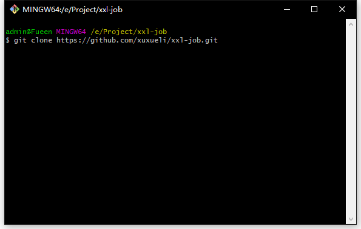

下载好之后将压缩包解压，然后通过IDEA打开，将Maven编译好后项目结构如下

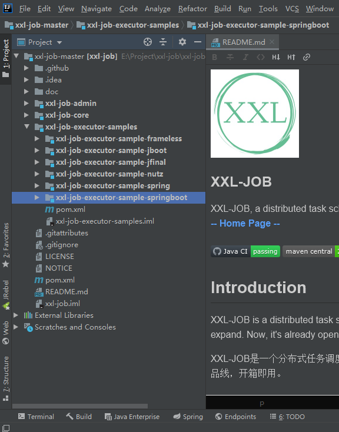

然后运行自带的tables_xxl_job.sql文件，在Navcation中去运行，生成需要的表

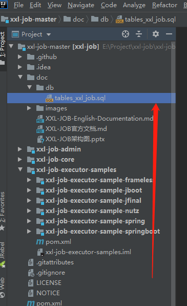

得到需要的基础表

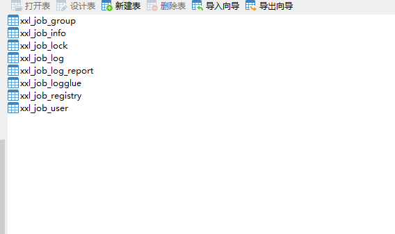
打开xxl-job-admin模块，在application.properties中进行后台的配置

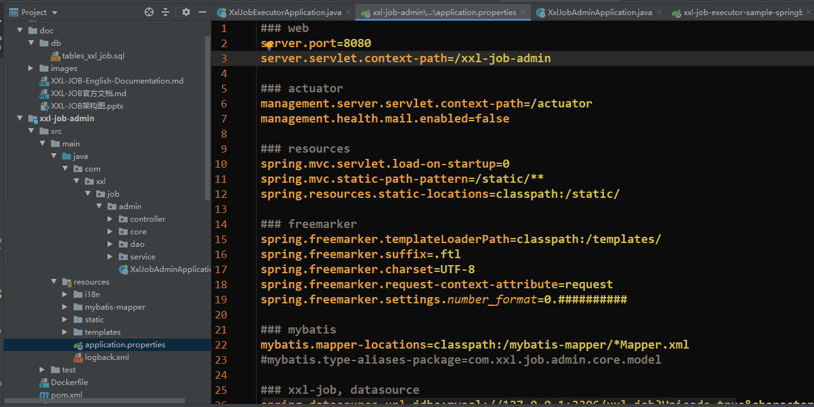

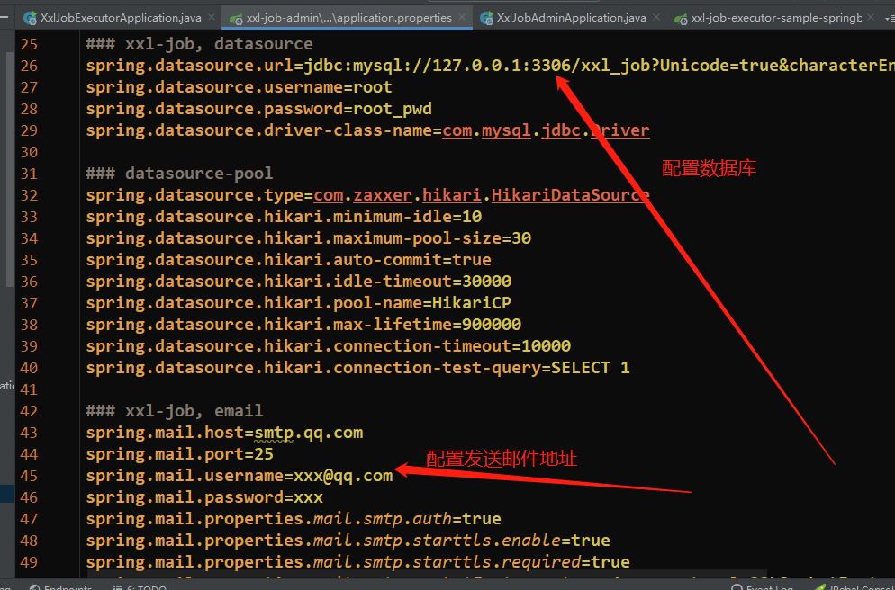

    注意在数据库地址哪里加上时区属性，否则乱码

    spring.datasource.url=jdbc:mysql://127.0.0.1:3306/xxl_job?Unicode=true&characterEncoding=UTF-8&serverTimezone=UTC

- 然后我们启动XxlJobAdminApplication类，访问http://localhost:8080/xxl-job-admin
- 默认账户admn，密码123456

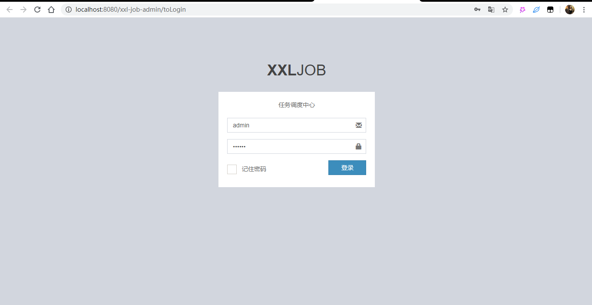

进来就可以看到主界面了

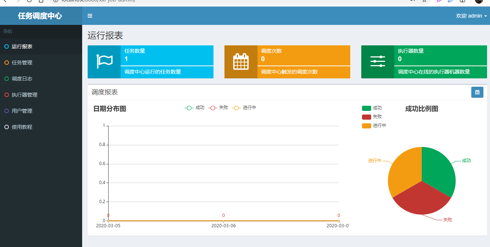

定位到springboot模块下的jobhandler层下面

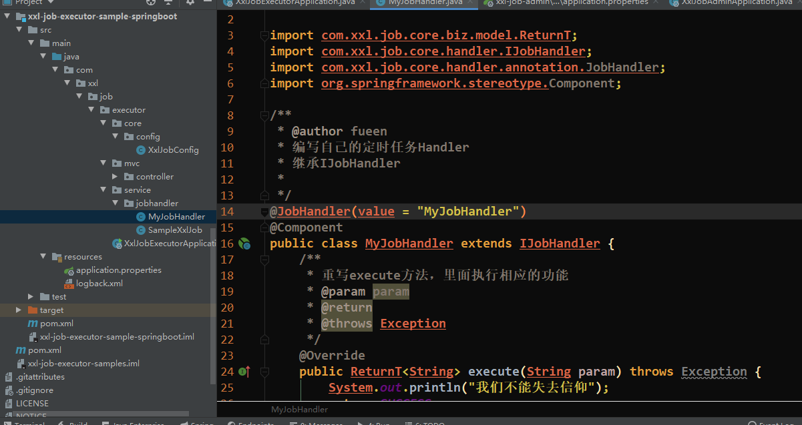

然后我们编写一个自己的定时任务来测试

    package com.xxl.job.executor.service.jobhandler;
    
    import com.xxl.job.core.biz.model.ReturnT;
    import com.xxl.job.core.handler.IJobHandler;
    import com.xxl.job.core.handler.annotation.JobHandler;
    import org.springframework.stereotype.Component;
    
    /**
     * @author fueen
     * 编写自己的定时任务Handler
     * 继承IJobHandler
     *
     */
    @JobHandler(value = "MyJobHandler")
    @Component
    public class MyJobHandler extends IJobHandler {
        /**
         * 重写execute方法，里面执行相应的功能
         * @param param
         * @return
         * @throws Exception
         */
        @Override
        public ReturnT<String> execute(String param) throws Exception {
            System.out.println("我们不能失去信仰");
            return SUCCESS;
        }
    }

在任务管理里面新增任务

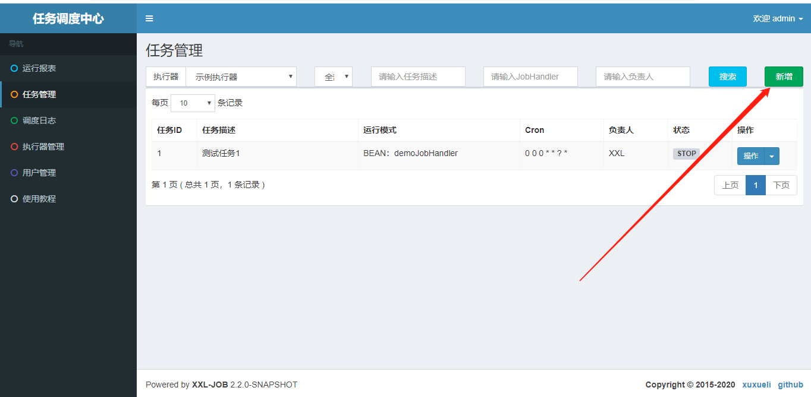

然后在找到刚刚添加的任务，点击操作里面的启动

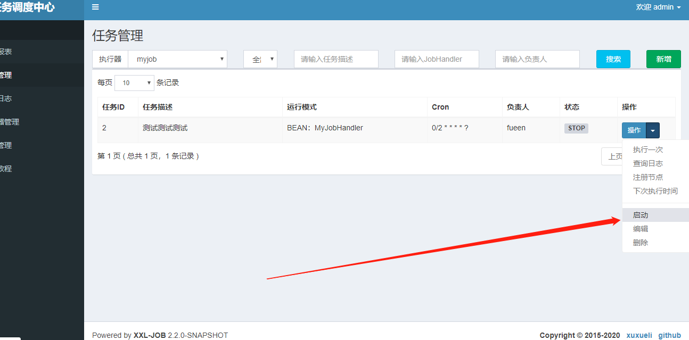
可以看到结果，刚刚编写的代码已经被执行了

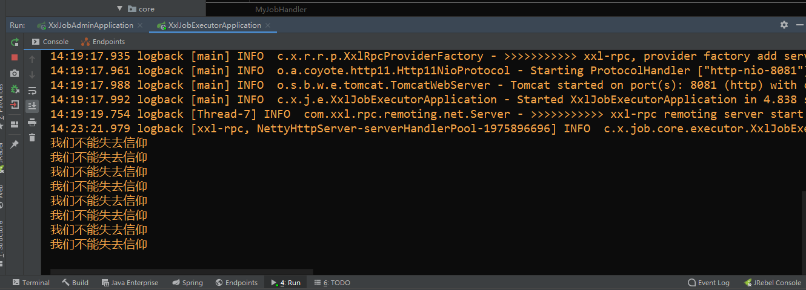

关于XXL-JOB的基本使用就到这里了，如果在项目中去集成也很简单

在项目中引入依赖

    <dependency>
      <groupId>com.xuxueli</groupId>
      <artifactId>xxl-job-core</artifactId>
      <version>2.0.1</version>
    </dependency>

将xxl-job-executor-sample-springboot这个模块下的XxlJobConfig复制一份到项目中，然后将相关配置设置好即可

