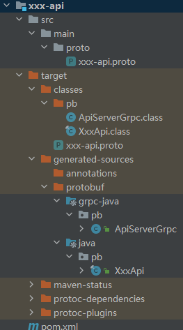

## 解答

**定义**

GPRC（A high-performance, open-source universal RPC framework） 由google开源。

所谓RPC(remote procedure call 远程过程调用)框架实际是提供了一套机制，使得应用程序之间可以进行通信，而且也遵从server/client模型。使用的时候客户端调用server端提供的接口就像是调用本地的函数一样。 下图为grpc的结构图
 

gRPC有什么好处以及在什么场景下需要用gRPC 既然是server/client模型，那么我们直接用restful api不是也可以满足吗，为什么还需要RPC呢？下面我们就来看看RPC到底有哪些优势

**gRPC vs. Restful API**

gRPC和restful API都提供了一套通信机制，用于server/client模型通信，而且它们都使用http作为底层的传输协议(严格地说, gRPC使用的http2.0，而restful api则不一定)。

不过gRPC还是有些特有的优势，如下：

gRPC可以通过protobuf来定义接口，从而可以有更加严格的接口约束条件。关于protobuf可以参见笔者之前的小文Google Protobuf简明教程

另外，通过protobuf可以将数据序列化为二进制编码，这会大幅减少需要传输的数据量，从而大幅提高性能。

gRPC可以方便地支持流式通信(理论上通过http2.0就可以使用streaming模式, 但是通常web服务的restful api似乎很少这么用，通常的流式数据应用如视频流，一般都会使用专门的协议如HLS，RTMP等，这些就不是我们通常web服务了，而是有专门的服务器应用。）

**使用场景**

需要对接口进行严格约束的情况，比如我们提供了一个公共的服务，很多人，甚至公司外部的人也可以访问这个服务，这时对于接口我们希望有更加严格的约束，我们不希望客户端给我们传递任意的数据，尤其是考虑到安全性的因素，我们通常需要对接口进行更加严格的约束。这时gRPC就可以通过protobuf来提供严格的接口约束。 对于性能有更高的要求时。有时我们的服务需要传递大量的数据，而又希望不影响我们的性能，这个时候也可以考虑gRPC服务，因为通过protobuf我们可以将数据压缩编码转化为二进制格式，通常传递的数据量要小得多，而且通过http2我们可以实现异步的请求，从而大大提高了通信效率。 但是，通常我们不会去单独使用gRPC，而是将gRPC作为一个部件进行使用，这是因为在生产环境，我们面对大并发的情况下，需要使用分布式系统来去处理，而gRPC并没有提供分布式系统相关的一些必要组件。而且，真正的线上服务还需要提供包括负载均衡，限流熔断，监控报警，服务注册和发现等等必要的组件。不过，这就不属于本篇文章讨论的主题了，我们还是先继续看下如何使用gRPC。

下面来进行实际的项目实战：

在IDEA中建立一个maven空项目，打包方式设置为<packaging>pom</packaging> 然后再再在这个maven空项目下建立3个module：分别为 xxx-api、 xxx-api-server、 xxx-api-client 其结构如下图所示：

**xxx-api**

首先我们来完成接口定义xxx-api项目。

**准备工作：**

要定义接口，我们需要先了解Protocol Buffers，这部分可自行学习，同时我们在idea上编写protocol buffers需要idea插件支持，在idea plugins中搜索protobuf support安装即可。

接下来我们对xxx-api工程中pom.xml，在该文件中增加以下内容：

    <dependencies>
        <dependency>
            <groupId>net.devh</groupId>
            <artifactId>grpc-spring-boot-starter</artifactId>
        </dependency>
    </dependencies>

    <build>
        <extensions>
            <extension>
                <groupId>kr.motd.maven</groupId>
                <artifactId>os-maven-plugin</artifactId>
                <version>1.4.1.Final</version>
            </extension>
        </extensions>
        <plugins>
            <plugin>
                <groupId>org.xolstice.maven.plugins</groupId>
                <artifactId>protobuf-maven-plugin</artifactId>
                <version>0.6.1</version>
                <configuration>
                    <protocArtifact>com.google.protobuf:protoc:3.0.0:exe:${os.detected.classifier}</protocArtifact>
                    <pluginId>grpc-java</pluginId>
                    <pluginArtifact>io.grpc:protoc-gen-grpc-java:1.0.0:exe:${os.detected.classifier}</pluginArtifact>
                </configuration>
                <executions>
                    <execution>
                        <goals>
                            <goal>compile</goal>
                            <goal>compile-custom</goal>
                        </goals>
                    </execution>
                </executions>
            </plugin>
            <plugin>
                <groupId>org.apache.maven.plugins</groupId>
                <artifactId>maven-compiler-plugin</artifactId>
                <configuration>
                    <source>8</source>
                    <target>8</target>
                </configuration>
            </plugin>
        </plugins>
    </build>
接着我们删除src/main下面的所有目录，新建一个名为proto的目录。然后在这个目录下新建protobuffer文件xxx-api.proto,如下图所示

在该文件中建立请求消息和返回消息，以及接口服务。分别如下

//请求消息 只有一个属性userName message GetUserInfoReq { string userName = 1; } //请求消息 有两个属性userName和address message GetUserInfoRes { string userName = 1; string address = 2; } // 在server 中定义一个接口 格式 ：rpc 接口方法( 请求消息) returns (返回消息） service ApiServer { rpc getUserInfo (GetUserInfoReq) returns (GetUserInfoRes); }

    syntax = "proto3";
    package pb;
    
    message GetUserInfoReq {
      string userName = 1;
    }
    
    message GetUserInfoRes {
      string userName = 1;
      string address = 2;
    }
    
    service ApiServer {
      rpc getUserInfo (GetUserInfoReq) returns (GetUserInfoRes);
    }
做完以上工作后，可以通过mvn compile 编译这个module,编译后会在target下出现信息，及说明接口定义成功。（对编译后生成的类和代码，我会再起一章进行讲解）

**xxx-api-server**

接口定义成功后，我们再来看grpc服务端xxx-api-server。 在服务端module中，我们把刚才定义的接口定义引入进来，在pom.xml中加入以下配置

    <dependencies>
      <dependency>
             <groupId>org.example</groupId>
             <artifactId>xxx-api</artifactId>
             <version>1.0-SNAPSHOT</version>
         </dependency>
         <dependency>
             <groupId>org.springframework.boot</groupId>
             <artifactId>spring-boot-starter-web</artifactId>
             <version>2.3.4.RELEASE</version>
         </dependency>
    </dependencies>
这里额外引入了一个spring-boot-starter-web ，便于启动容器后调用接口测试用，也可以不引入web容器，这里自己决定即可。

接着我们需要新建一个类来继承抽象类ApiServerGrpc.ApiServerImplBase，并重写其下的我们自己定义的方法getUserInfo。 在新建的类上加入注解@GrpcService，在springboot应用启动时，会根据这个注解找到我们的服务。

@GrpcService
public class TestGrpcServer extends ApiServerGrpc.ApiServerImplBase {

    @Override
    public void getUserInfo(XxxApi.GetUserInfoReq request, StreamObserver<XxxApi.GetUserInfoRes> responseObserver) {
        try {
            XxxApi.GetUserInfoRes res = XxxApi.GetUserInfoRes.newBuilder().setAddress("重庆 渝中 解放碑XXX号").setUserName("username")
                    .build();
            responseObserver.onNext(res);
            responseObserver.onCompleted();
        } catch (Exception e) {
            responseObserver.onError(e);
        }
    }
}
启动springboot应用即可开启grpc服务，这里grpc默认的端口是9090，可配置也可以不配置。如果要配置的话 需要在spring配置文件中配置grpc.server.port。 至此grpc server端也完成了。

**xxx-api-client**

最后我们再来写客户端xxx-api-client。 客户端也需要将xxx-api 引入到工程中，pom.xml配置如下：

    <dependencies>
        <dependency>
            <groupId>org.example</groupId>
            <artifactId>xxx-api</artifactId>
            <version>1.0-SNAPSHOT</version>
        </dependency>
        <dependency>
            <groupId>org.springframework.boot</groupId>
            <artifactId>spring-boot-starter-web</artifactId>
            <version>2.3.4.RELEASE</version>
        </dependency>
        <dependency>
            <groupId>net.devh</groupId>
            <artifactId>grpc-spring-boot-starter</artifactId>
            <exclusions>
                <exclusion>
                    <groupId>net.devh</groupId>
                    <artifactId>grpc-server-spring-boot-starter</artifactId>
                </exclusion>
            </exclusions>
        </dependency>
    </dependencies>
这里我们只需要客户端调用，本身并不开启服务，所以这里引入grpc包时，去掉了server的相应包。

再配置grpc信息，spring配置文件yml中加入如下配置：

    grpc:
      client:
        xxx-api-server:
          address: static://127.0.0.1:9090
          enableKeepAlive: true
          keepAliveWithoutCalls: true
          negotiationType: PLAINTEXT
记住这里的xxx-api-server 同时address 配置为服务端的地址和端口，这里我们指定shema为static (schema有多种）。

接口我们编写调用客户端，新建一个service类，注入ApiServerGrpc.ApiServerBlockingStub属性。 使用注解@GrpcClient 并设置其值为我们上面配置的client xxx-api-server 代码如下：

    @Service
    public class TestService {
        @GrpcClient("xxx-api-server")
        private ApiServerGrpc.ApiServerBlockingStub serverBlockingStub;
    
        public void test() {
            XxxApi.GetUserInfoRes res = serverBlockingStub.getUserInfo(XxxApi.GetUserInfoReq.newBuilder().setUserName("ljw").build());
            System.out.println(res);
        }
    }
正常启动springboot应用，调用TestService中的test()方法即可验证是否调用成功，前提是服务端开启的情况下。

控制台打印以下信息说明grpc调用成功：

