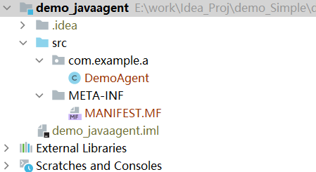
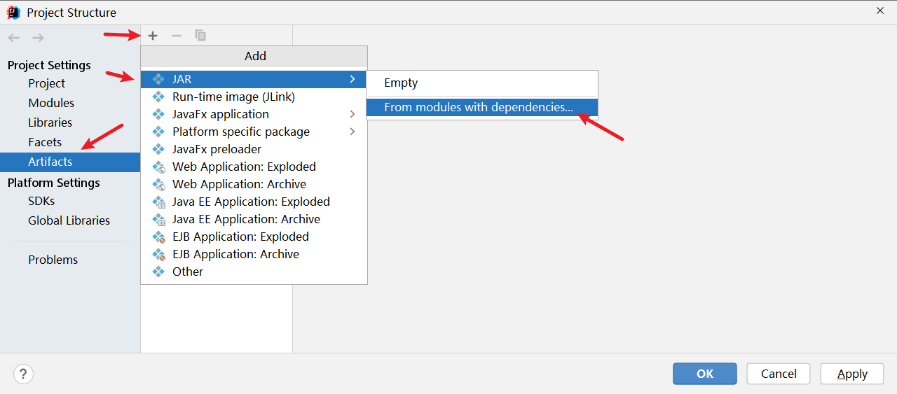
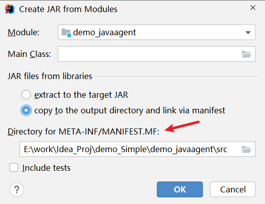
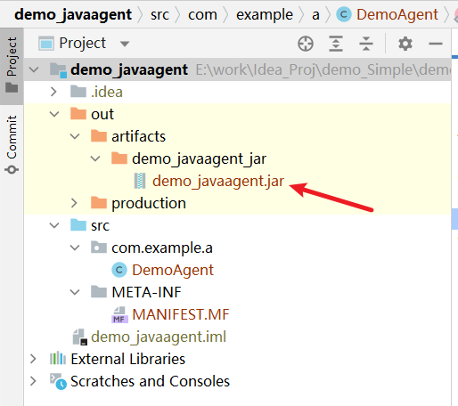
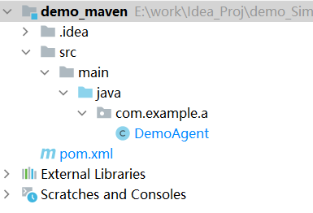
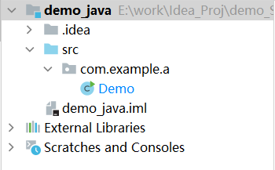
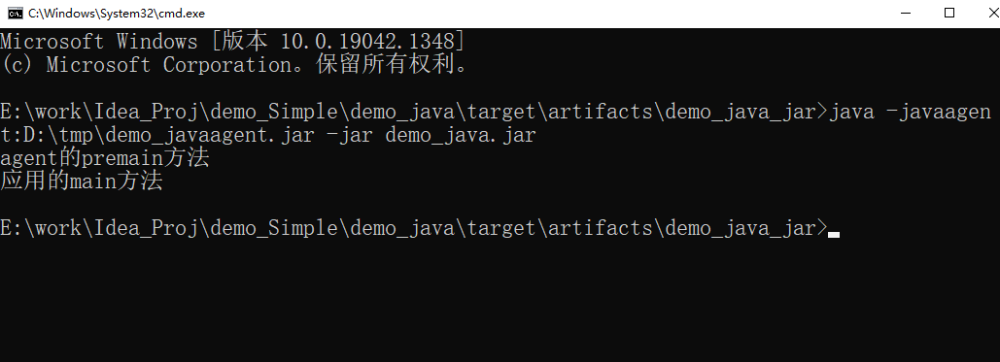
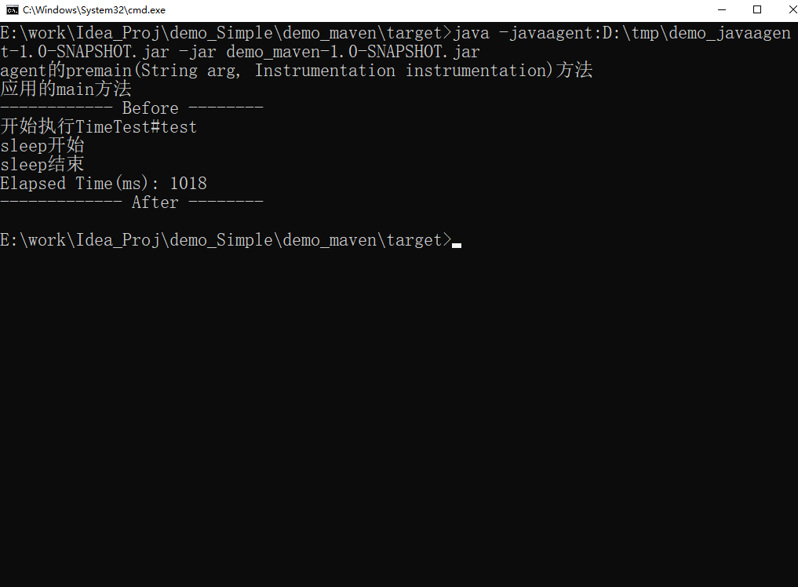

## **简介**
        本文用示例介绍javaagent的用法。

## **javaagent简介**
        JavaAgent 是JDK 1.5 以后引入的，也叫做Java代理。

**javaagent的作用**

- 可以在加载java文件之前进行拦截，修改字节码。
- 可以在运行期间修改已经加载的类的字节码。
- 这种用法有很多的限制。
- javaagent结合javassist功能更强大：可以创建类、方法、变量等。

这实际上提供了一种虚拟机级别的 AOP 实现方式。通过以上方法就能实现对一些框架或是技术的采集点进行字节码修改，完成这些功能：对应用进行监控，对执行指定方法或是接口时额外添加操作（打印日志、打印方法执行时间、采集方法的入参和结果等）。

很多APM监控系统就是基于此实现的，例如：Arthas、SkyWalking。

**javaagent的使用方式**

- 方式1：在一个普通 Java 程序（带有 main 函数的 Java 类）运行时，通过 -javaagent 参数指定一个特定的 jar 文件（包含 Instrumentation 代理）来启动 Instrumentation 的代理程序。
-javaagent 这个参数的个数是不限的，如果指定了多个，则会按指定的先后执行，执行完各个 agent 后，才会执行主程序的 main 方法。例如：

    java -javaagent:D:\workspace\javaagent.jar=hello1 -javaagent:D:\workspace\javaagent.jar=hello2 -jar D:\workspace\myTest.jar

- 方式2：在一个普通 Java 程序（带有 main 函数的 Java 类）运行时，通过 Java Tool API 中的 attach 方式指定进程id和特定jar包地址，启动 Instrumentation 的代理程序。

**javaagent其他的功能**

- 获取所有已经被加载过的类
- 获取所有已经被初始化过了的类（执行过了clinit方法，是上面的一个子集）
- 获取某个对象的大小
- 将某个jar加入到bootstrapclasspath里作为高优先级被bootstrapClassloader加载
- 将某个jar加入到classpath里供AppClassload去加载
- 设置某些native方法的前缀，主要在查找native方法的时候做规则匹配

## **静态agent与动态agent**

Agent分为如下两种：

- 静态Instrument：在main加载之前运行的Agent
- 动态Instrument：在main运行之后运行的Agent（JDK1.6以后提供）。

**静态Instrument（启动时）加载Instrument过程**

- 创建并初始化 JPLISAgent；
- 监听VMInit事件，在JVM初始化完成之后做下面的事情：

  -    创建InstrumentationImpl对象；
  -    监听ClassFileLoadHook事件；
  -    调用InstrumentationImpl的loadClassAndCallPremain方法，在这个方法里会去调用javaagent中MANIFEST.MF里指定的Premain-Class类的premain方法 ；
     
- 解析javaagent中MANIFEST.MF文件的参数，并根据这些参数来设置JPLISAgent里的一些内容。

**动态Instrument运行时加载Instrument过程**

通过JVM的attach机制来请求目标JVM加载对应的agent，过程大致如下：

- 创建并初始化JPLISAgent；
- 解析 javaagent 里 MANIFEST.MF 里的参数；
- 创建 InstrumentationImpl 对象；
- 监听 ClassFileLoadHook 事件；
- 调用 InstrumentationImpl 的loadClassAndCallAgentmain方法，在这个方法里会去调用javaagent里 MANIFEST.MF 里指定的Agent-Class类的agentmain方法。
 
## **示例1：简单用法**

**agent程序**

项目结构

**1.提供premain方法**

    package com.example.a;
     
    import java.lang.instrument.Instrumentation;
     
    public class DemoAgent {
        /**
         * 该方法在main方法之前运行，与main方法运行在同一个JVM中
         */
        public static void premain(String arg, Instrumentation instrumentation) {
            System.out.println("agent的premain(String arg, Instrumentation instrumentation)方法");
        }
     
        /**
         * 若不存在 premain(String agentArgs, Instrumentation inst)，
         * 则会执行 premain(String agentArgs)
         */
        public static void premain(String arg) {
            System.out.println("agent的premain(String arg)方法");
        }
    }

**2.提供META-INF/MANIFEST.MF**

在src/main/java的同级目录下新建META-INF文件夹，在里边新建MANIFEST.MF文件（注意最后一行必须是空行）

    Manifest-Version: 1.0
    Can-Redefine-Classes: true
    Can-Retransform-Classes: true
    Premain-Class: com.example.a.DemoAgent
    
     
- Premain-Class ：包含 premain 方法的类（类的全路径名）
- Agent-Class ：包含 agentmain 方法的类（类的全路径名）
- Boot-Class-Path ：设置引导类加载器搜索的路径列表。查找类的特定于平台的机制失败后，引导类加载器会搜索这些路径。按列出的顺序搜索路径。列表中的路径由一个或多个空格分开。路径使用分层 URI 的路径组件语法。如果该路径以斜杠字符（“/”）开头，则为绝对路径，否则为相对路径。相对路径根据代理 JAR 文件的绝对路径解析。忽略格式不正确的路径和不存在的路径。如果代理是在 VM 启动之后某一时刻启动的，则忽略不表示 JAR 文件的路径。（可选）
- Can-Redefine-Classes ：true表示能重定义此代理所需的类，默认值为 false（可选）
- Can-Retransform-Classes ：true 表示能重转换此代理所需的类，默认值为 false （可选）
- Can-Set-Native-Method-Prefix： true表示能设置此代理所需的本机方法前缀，默认值为 false（可选）

**3.将其打包为jar包**

步骤1：打包的配置入口

- File=> Project Structure=> Project Settings=> Artifacts=> + => JAR=> From modules with dependencies...

步骤2：打包的配置

步骤3：打包

Build=> Build Artifacts...=> Build

此时会生成out目录，并生成jar包：

**也可使用maven配置META-INF/MANIFEST.MF**

使用maven，打包方便，而且不用手写META-INF/MANIFEST.MF，用插件即可：

    <build>
        <plugins>
            <plugin>
                <groupId>org.apache.maven.plugins</groupId>
                <artifactId>maven-compiler-plugin</artifactId>
                <version>3.5.1</version>
                <!-- 指定maven编译的jdk版本。若不指定,maven3默认用jdk 1.5 maven2默认用jdk1.3 -->
                <configuration>
                    <source>8</source>
                    <target>8</target>
                </configuration>
            </plugin>
     
            <plugin>
                <groupId>org.apache.maven.plugins</groupId>
                <artifactId>maven-jar-plugin</artifactId>
                <version>3.2.0</version>
                <configuration>
                    <archive>
                        <!--自动添加META-INF/MANIFEST.MF -->
                        <manifest>
                            <addClasspath>true</addClasspath>
                        </manifest>
                        <manifestEntries>
                            <Menifest-Version>1.0</Menifest-Version>
                            <Premain-Class>com.example.a.DemoAgent</Premain-Class>
                            <Can-Redefine-Classes>true</Can-Redefine-Classes>
                            <Can-Retransform-Classes>true</Can-Retransform-Classes>
                        </manifestEntries>
                    </archive>
                </configuration>
            </plugin>
        </plugins>
    </build>

maven的项目结构为：

**应用程序**
项目结构

**1.提供main程序**

    package com.example.a;
     
    public class Demo {
        public static void main(String[] args) {
            System.out.println("应用的main方法");
        }
    }
**2.打包**

打包方法和agent的项目略有不同。见：Intellij IDEA--将Java项目打包为jar包--方法/实例_IT利刃出鞘的博客-CSDN博客 

**测试**
    java -javaagent:D:\tmp\demo_javaagent.jar -jar demo_java.jar

结果：

## **示例2：统计方法的执行时间**
需求：写一个agent，统计应用的某个方法的执行时间。（本处要统计的方法是：TimeTest#test方法）

**agent程序**

**agent代码**

    package com.example.a;
     
    import java.lang.instrument.Instrumentation;
     
    public class DemoAgent {
        /**
         * 该方法在main方法之前运行，与main方法运行在同一个JVM中
         */
        public static void premain(String arg, Instrumentation instrumentation) {
            System.out.println("agent的premain(String arg, Instrumentation instrumentation)方法");
     
            instrumentation.addTransformer(new MyTransformer());
        }
     
        /**
         * 若不存在 premain(String agentArgs, Instrumentation inst)，
         * 则会执行 premain(String agentArgs)
         */
        public static void premain(String arg) {
            System.out.println("agent的premain(String arg)方法");
        }
    }

**Transformer代码**

    package com.example.a;
     
    import javassist.ClassPool;
    import javassist.CtClass;
    import javassist.CtMethod;
     
    import java.lang.instrument.ClassFileTransformer;
    import java.lang.instrument.IllegalClassFormatException;
    import java.security.ProtectionDomain;
     
    public class MyTransformer implements ClassFileTransformer {
        private final String injectedClass = "com.example.a.TimeTest";
        private final String injectedMethod = "test";
     
        @Override
        public byte[] transform(ClassLoader loader,
                                String className,
                                Class<?> classBeingRedefined,
                                ProtectionDomain protectionDomain,
                                byte[] classfileBuffer) throws IllegalClassFormatException {
     
            String realClassName = className.replace("/", ".");
     
            if (realClassName.equals(injectedClass)) {
                CtClass ctClass;
                try {
                    // 使用全称，取得字节码类<使用javassist>
                    ClassPool classPool = ClassPool.getDefault();
                    ctClass = classPool.get(realClassName);
     
                    // 得到方法实例
                    CtMethod ctMethod = ctClass.getDeclaredMethod(injectedMethod);
                    // 添加变量
                    ctMethod.addLocalVariable("time", CtClass.longType);
                    ctMethod.insertBefore("System.out.println(\"------------ Before --------\");");
                    ctMethod.insertBefore("time = System.currentTimeMillis();");
     
                    ctMethod.insertAfter("System.out.println(\"Elapsed Time(ms): \" + (System.currentTimeMillis() - time));");
                    ctMethod.insertAfter("System.out.println(\"------------- After --------\");");
     
                    return ctClass.toBytecode();
                } catch (Throwable e) { //这里要用Throwable，不要用Exception
                    System.out.println(e.getMessage());
                    e.printStackTrace();
                }
            }
     
            // 返回原类字节码
            return classfileBuffer;
        }
    }

**pom.xml**

    <?xml version="1.0" encoding="UTF-8"?>
    <project xmlns="http://maven.apache.org/POM/4.0.0"
             xmlns:xsi="http://www.w3.org/2001/XMLSchema-instance"
             xsi:schemaLocation="http://maven.apache.org/POM/4.0.0 http://maven.apache.org/xsd/maven-4.0.0.xsd">
      <modelVersion>4.0.0</modelVersion>
     
      <groupId>com.example</groupId>
      <artifactId>demo_javaagent</artifactId>
      <version>1.0-SNAPSHOT</version>
     
      <dependencies>
        <dependency>
          <groupId>org.javassist</groupId>
          <artifactId>javassist</artifactId>
          <version>3.28.0-GA</version>
        </dependency>
      </dependencies>
     
      <build>
        <plugins>
          <plugin>
            <groupId>org.apache.maven.plugins</groupId>
            <artifactId>maven-compiler-plugin</artifactId>
            <version>3.5.1</version>
            <!-- 指定maven编译的jdk版本。若不指定,maven3默认用jdk 1.5 maven2默认用jdk1.3 -->
            <configuration>
              <source>8</source>
              <target>8</target>
            </configuration>
          </plugin>
     
          <plugin>
            <groupId>org.apache.maven.plugins</groupId>
            <artifactId>maven-jar-plugin</artifactId>
            <version>3.2.0</version>
            <configuration>
              <archive>
                <!--自动添加META-INF/MANIFEST.MF -->
                <manifest>
                  <addClasspath>true</addClasspath>
                </manifest>
                <manifestEntries>
                  <Menifest-Version>1.0</Menifest-Version>
                  <Premain-Class>com.example.a.DemoAgent</Premain-Class>
                  <Can-Redefine-Classes>true</Can-Redefine-Classes>
                  <Can-Retransform-Classes>true</Can-Retransform-Classes>
                </manifestEntries>
              </archive>
            </configuration>
          </plugin>
        </plugins>
      </build>
     
     
    </project>

**应用程序**

**main类**

    package com.example.a;
     
    public class Demo {
        public static void main(String[] args) {
            System.out.println("应用的main方法");
            new TimeTest().test();
        }
    }
**测试类**

    package com.example.a;
     
    public class TimeTest {
        public void test() {
            System.out.println("开始执行TimeTest#test");
            System.out.println("sleep开始");
            try {
                Thread.sleep(1000);
            } catch (InterruptedException e) {
                e.printStackTrace();
            }
            System.out.println("sleep结束");
        }
    }
**pom.xml**

    <?xml version="1.0" encoding="UTF-8"?>
    <project xmlns="http://maven.apache.org/POM/4.0.0"
             xmlns:xsi="http://www.w3.org/2001/XMLSchema-instance"
             xsi:schemaLocation="http://maven.apache.org/POM/4.0.0 http://maven.apache.org/xsd/maven-4.0.0.xsd">
        <modelVersion>4.0.0</modelVersion>
     
        <groupId>com.example</groupId>
        <artifactId>demo_maven</artifactId>
        <version>1.0-SNAPSHOT</version>
     
        <dependencies>
            <dependency>
                <groupId>org.javassist</groupId>
                <artifactId>javassist</artifactId>
                <version>3.28.0-GA</version>
            </dependency>
        </dependencies>
     
        <build>
            <plugins>
                <plugin>
                    <groupId>org.apache.maven.plugins</groupId>
                    <artifactId>maven-compiler-plugin</artifactId>
                    <version>3.5.1</version>
                    <!-- 指定maven编译的jdk版本。若不指定,maven3默认用jdk 1.5 maven2默认用jdk1.3 -->
                    <configuration>
                        <source>8</source>
                        <target>8</target>
                    </configuration>
                </plugin>
     
                <plugin>
                    <artifactId>maven-assembly-plugin</artifactId>
                    <configuration>
                        <archive>
                            <manifest>
                                <mainClass>com.example.a.Demo</mainClass>
                            </manifest>
                        </archive>
                        <descriptorRefs>
                            <descriptorRef>jar-with-dependencies</descriptorRef>
                        </descriptorRefs>
                        <appendAssemblyId>false</appendAssemblyId>
     
                    </configuration>
     
                    <executions>
                        <execution>
                            <id>make-assembly</id>
                            <phase>package</phase>
                            <goals>
                                <goal>assembly</goal>
                            </goals>
                        </execution>
                    </executions>
                </plugin>
            </plugins>
        </build>
    </project>

**测试**

    java -javaagent:D:\tmp\demo_javaagent-1.0-SNAPSHOT.jar -jar demo_maven-1.0-SNAPSHOT.jar

结果：
