## 解答

## 引子
说到OSGi，可能有些人会有些懵，这个概念的知名度确实不像JVM、Spring全家桶等这种“网红”人物这么出名，OSGi联盟成立于1999年，直到2007年的时候，能否采纳还没有被业界定论，2009年，才正式使用，不过，他与JVM一样，在Java的世界里地位可不低；

开门见山，OSGi是为了弥补java模块化的不足推出的技术，说到模块化有人可能会疑惑，java没有模块化吗？那包是管着干嘛的？确实，java对细粒度的模块的支持度很高，但是粗粒度模块的支持就没有那么高了；

OSGi的官方解释是：OSGi框架为java定义了一个动态模块化的系统，能够更好的控制代码结构，动态管理代码的生命周期，并且提供了代码协作的松耦合方式；

想想如果没有OSGi会怎样？多个类加载器，以及进程内部组件之间序列化的问题该怎么解决？这些问题在编译或者是执行的时候是不会像空指针异常一样作强制性的检查，但是一旦出了问题对于大型项目而言就是大麻烦，为了能够更好的开发、部署和执行，OSGi应运而生；

现在的OSGi的应用非常广泛，大名鼎鼎的Eclipse就有用到OSGi，很多大企业也都是用的OSGi,比如阿里巴巴，那可是OSGi的忠实粉丝，支付宝、淘宝还有阿里巴巴平台等都是用的OSGi框架，OSGi正在逐渐成为主流，在不久的将来，OSGi也会像JVM、Spring等一样成为必备技术的；

## OSGi的重要性
也许刚才的官方解释有些晦涩难懂，换句话说就是：OSGi是java平台（注意，是平台而不是语言！）的模块化层；

可能这句 话还是不能很好的表达，其中的模块化层是个拦路虎，下面就先来认识一下模块化，官方解释是：模块化是指讲一个大系统从逻辑上分解为相互协作的部分

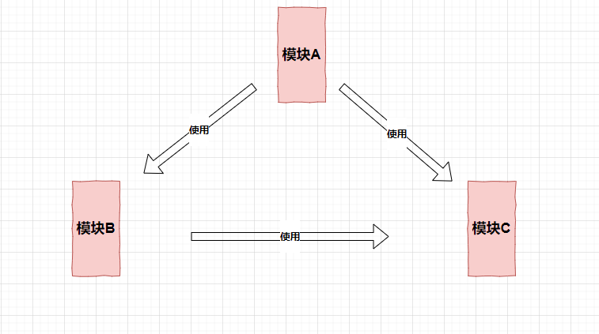

还是等于没说？这样说吧，我用硬件来做比喻，假如我买了个平装电脑，组装的过程中发现，零件不是很够，比如说音响就没有，于是我又买了一个音响，结果买回来发现音响和电脑不是很兼容，于是我就想，能不能有一个通用的接口或者是通用的标准，让我可以安装上音响；

这里的电脑就好比一个平台，音响就好比是一个插件，如果有一个通用的框架，实现了跨平台的插件体系，使用者既可以使用已有的插件，也可以自己开发插件供别人使用，同时在运行时，还可以动态的安装或者是卸载等，实现插件的“热插拔”

听起来 有点像是汽车生产里的标准化，但他更先进，也更加的智能，OSGi可以做到自动的根据接口来进行接入，就好比，我拧螺丝的时候必须要保证螺丝与螺母是匹配的，但是OSGi可以自动匹配螺母！

认识到OSGi的强大之处，再来看一下java的模块化究竟有什么不足，毕竟，要做到知自知彼嘛

第一，低层代码的可见性控制。这里的所谓可见性就是指的：public 、private等访问修饰符的工作，这些访问修饰符只是面向对象这个层面的封装，而不是逻辑系统的划分，如果有时候项目需要特定的代码分属不同的包的话，这些访问修饰符可做不到，包也做不到，包主要是解决命名冲突的；

第二，易混淆的类路径概念。因为类路径隐藏了代码版本、依赖以及一致性等，就拿代码版本来说吧，如果类路径中同一个包中的多个不同版本，那么类路径就会这些不同版本的包是不同的包，就如同认为23岁的我和24岁的我不是同一个人一样；

第三，部署和管理支持上的不足

 

## OSGi的一些重要概念
**Bundle**

Bundle其实就是个jar包， 是OSGi特定描述的一个jar包，具体位置在META-INF目录下的MANIFEST.MF文件，Bundle有很多中状态，他们之间的转换关系如图所示；

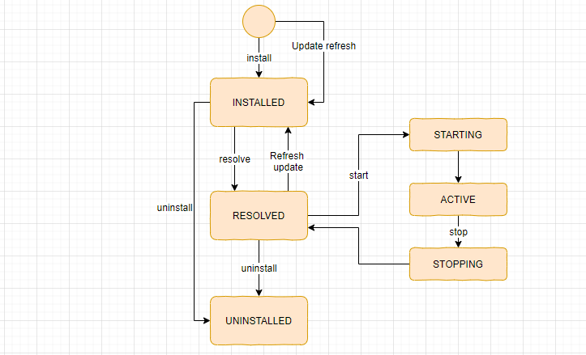 

这样做的好处就是很好的隔离了外部类和内部类，一个个的Bundle组成了基于OSGi的应用，Bundle是组件和服务的载体；

那么，Bundle之间是如何交互的呢？这就要用到Service;

**Service**

一个OSGi Service就是一个注册到OSGi框架中的java对象，在注册的时候可以设置Service的属性，在获取Service的时候也可以根据属性进行过滤，具体交互过程如图所示；

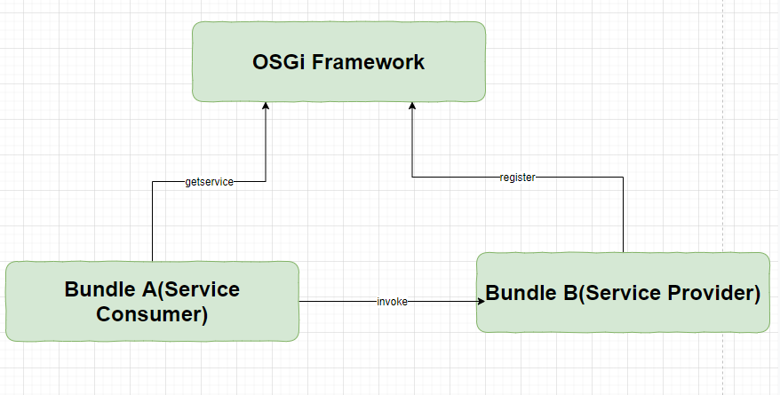

**SOCM**

SOCM的全称是：Service-Oriented Component Model。意思是面向服务的组件模型，这里的Component,任何一个普通的java对象都可以通过配置文件中的定义来得到，Component其实就是服务的载体，既可以提供对外使用的服务也可以使用外部服务；

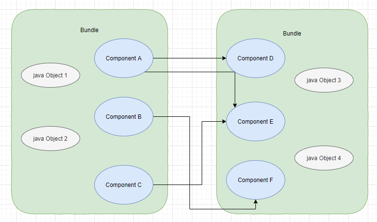

那么，问题又来了，Component如何组装起来呢？这就要用到Declarative Service;

 
**Declarative Service**

其简称DS，DS可以让我们在Bundle中定义Component,通过配置的方式发布服务和获取服务；

## OSGi框架

OSGi框架属于OSGi服务平台，除此之外还有OSGi标准服务，前者是提供OSGi功能的运行环境，后者是定义了很多用于常见任务的可重用API，后者我们不需要参与，直接用就好，前者才是重点；

OSGi就如同操作系统一样，为应用程序的运行提供运行环境，我们并不能直接感受到操作系统，但是他一直为我们服务，同样，OSGi我们感知不到他的存在，但是我们却每时每刻都在享受他带给我们的便利；

OSGi一共分三层，就如同网络分层结构一样，层次分明同时逐层依赖，顺序是万万不能颠倒的；

 
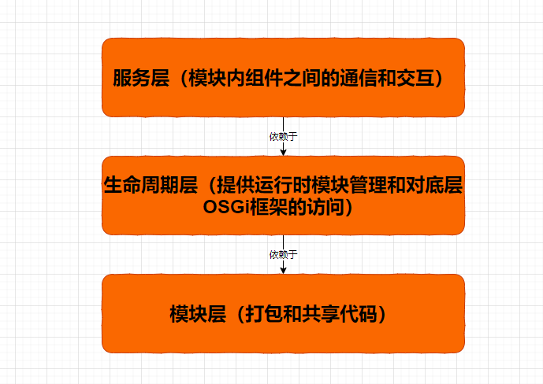

模块层：模块层定义了OSGi的概念，称之为bundle，可以说跟模块层打交道主要就是跟Bundle打交道，也正因如此，我才把Bundle等重要概念放在前面，之前说的Bundle可能有些复杂，其实Bundle就是个包含元数据、类文件和 相关资源的jar包，但又比普通的jar包更强大，Bundle可以声明哪些包可以对外可见，也就是哪些包是可以导出的，以及可以声明可以依赖哪些外部包，也就是哪些包是可以导入的；

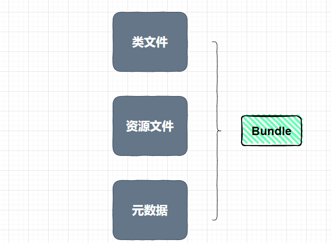

下面是模块层的hello world的代码示例

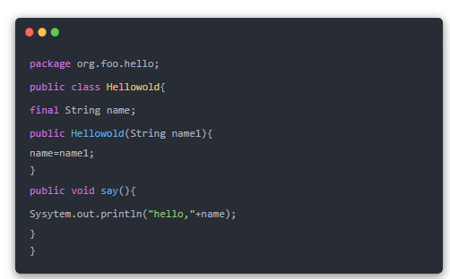

同时也应该在META-INF目录下的MANIFEST.MF文件中添加一写元数据信息；

 

生命周期层： 如果说之前的模块层负责盖房子，这一层就好比是房子盖好之后搞装修，把水电这类的通好才能生活；生命周期层一个是在应用程序的外部定义了Bundle生命周期的操作（安装、卸载等），另一个就是在应用程序的内部定义了Bundle如何访问他们的执行环境；

下面是生命周期层的hello world的代码示例

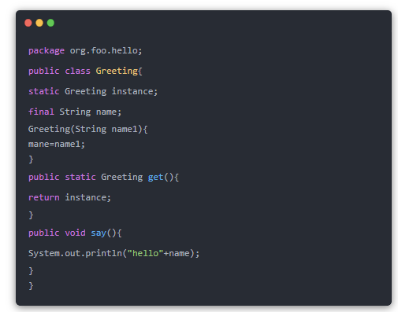

同时还要实现一个Bundle的激活器

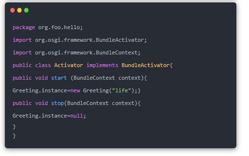 

服务层的工作原理与面向服务相似

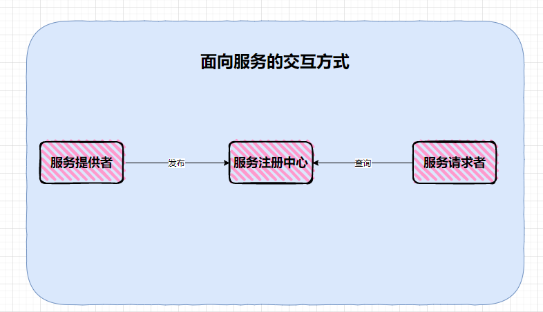

实现的时候先定义一个接口再实现，

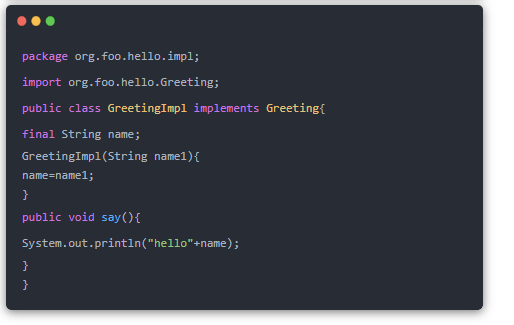

用Bundle激活器完成服务注册

用Bundle激活器完成服务发现
 
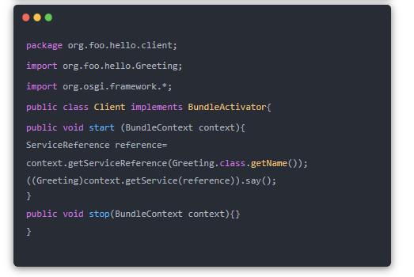
