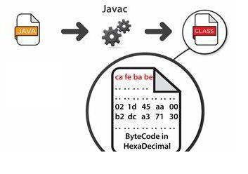
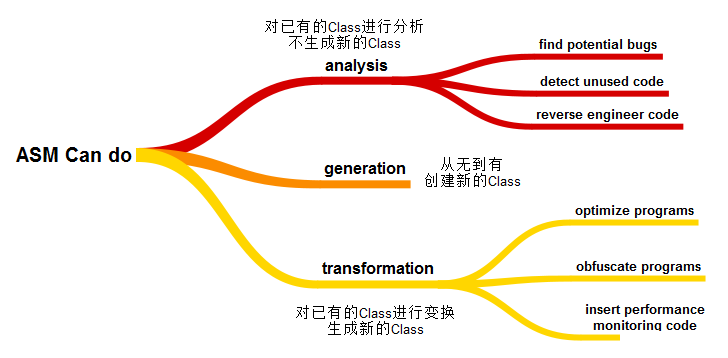
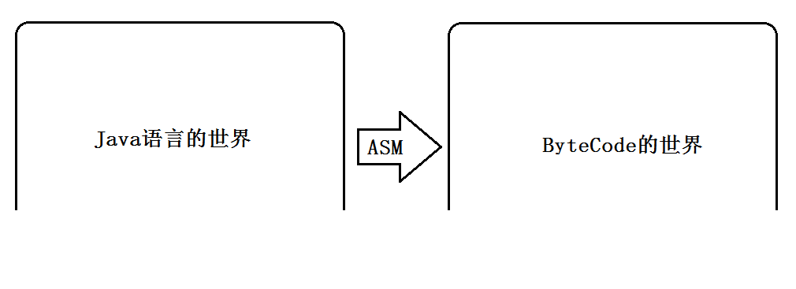

## ASM是什么？
ASM是一个操作Java字节码的类库。

为了能够更好的理解ASM是什么，我们需要来搞清楚两个问题：

第一个问题，ASM的操作对象是什么呢？
第二个问题，ASM是如何处理字节码（ByteCode）数据的？
首先，我们来看第一个问题：ASM的操作对象是什么呢？ 回答：ASM所操作的对象是字节码（ByteCode）数据。

我们都知道，一个.java文件经过Java编译器（javac）编译之后会生成一个.class文件。
在.class文件中，存储的是字节码（ByteCode）数据，如下图所示。ASM所的操作对象是是字节码（ByteCode），而在许多情况下，字节码（ByteCode）的具体表现形式是.class文件。




接着，我们来看第二个问题：ASM是如何处理字节码（ByteCode）数据的？ 回答：ASM处理字节码（ByteCode）的方式是“拆分－修改－合并”。

ASM处理字节码（ByteCode）数据的思路是这样的：第一步，将.class文件拆分成多个部分；第二步，对某一个部分的信息进行修改；第三步，将多个部分重新组织成一个新的.class文件。

在 Wikipedia上，对ASM进行了如下描述：

ASM provides a simple API for decomposing(将一个整体拆分成多个部分), modifying(修改某一部分的信息), and recomposing(将多个部分重新组织成一个整体) binary Java classes (i.e. ByteCode).

## ASM的过去和现在
### ASM的过去
对于ASM的过去，主要说明三个问题：

第一个问题，ASM从什么时候开始出现的？
第二个问题，ASM的作者是谁？
第三个问题，ASM的名字有什么含义？
在2002年的时候，Eric Bruneton、Romain Lenglet和Thierry Coupaye发表了一篇文章，名为《 ASM: a code manipulation tool to implement adaptable systems》。在这篇文章当中，他们提出了ASM的设计思路。

一般来说，大写字母的组合，可能是多个单词的缩写形式，例如，JVM表示“Java Virtual Machine”。但是，ASM并不是多个单词的首字母缩写形式。在上面的文章中，记录了下面的话：

The ASM name does not mean anything: it is just a reference to the __asm__ keyword in C,
which allows some functions to be implemented in assembly language.

### ASM的现在
对于ASM的现在，主要说明两个问题：

第一个问题，ASM属于哪一个机构？
第二个问题，ASM的Logo是什么样的？
The ASM library is a project of the  OW2 Consortium. OW2 is an independent, global, open-source software community.

作为一个小故事，我们来说一下OW2组织是如何形成的。OW2组织的形成，与中国的一些大学和公司也有很大的关系（原文内容来自 这里）：

2002年，ObjectWeb项目启动，它是由INRIA、Bull和France Telecom共同开发的项目，并形成了一个成熟的、开源软件社区。
2004年，Orientware项目启动，由中国的北京大学、北航、国防科技大学、中创软件和中国科学院软件研究所共同研发。
2005年，ObjectWeb和Orientware签署了一份协议，决定共享代码库，一起开发中间件软件。
2006年，ObjectWeb和Orientware两个社区组织融合，形成了OW2组织。OW2组织名字，可能是由ObjectWeb和Orientware名称当中的两组O和W组合而来。
ASM的Logo设计很有特点，它在旋转的过程中，会分别呈现出“A”、“S”和“M”这三个字母，如下图所示：


### ASM的版本发展
对于ASM版本的发展，我们要说明两点：

第一点，Java语言在不断发展，那么，ASM版本也要不断发展来跟得上Java的发展。
第二点，在选择ASM版本的时候，要注意它支持的Java版本，来确保兼容性。
比如说，我们常用的Java版本是Java 8和Java 11。针对Java 8版本，我们需要使用ASM 5.0版本，就能正常工作。对于Java 11版本，我们需要使用ASM 7.0版本，就能正常工作。当然，我们可以尽量使用较高的ASM版本。


## ASM能够做什么
### 通俗的理解
父类：修改成一个新的父类
接口：添加一个新的接口、删除已有的接口
字段：添加一个新的字段、删除已有的字段
方法：添加一个新的方法、删除已有的方法、修改已有的方法
……（省略）
```java
public class HelloWorld extends Object implements Cloneable {
    public int intValue;
    public String strValue;

    public int add(int a, int b) {
        return a + b;
    }

    public int sub(int a, int b) {
        return a - b;
    }

    @Override
    public Object clone() throws CloneNotSupportedException {
        return super.clone();
    }
}

```

### 专业的描述
ASM is an all-purpose(多用途的；通用的) Java ByteCode manipulation and analysis framework.
It can be used to modify existing classes or to dynamically generate classes, directly in binary form.

The goal of the ASM library is to generate, transform and analyze compiled Java classes,
represented as byte arrays (as they are stored on disk and loaded in the Java Virtual Machine).




Program analysis, which can range from a simple syntactic parsing to a full semantic analysis, can be used to find potential bugs in applications, to detect unused code, to reverse engineer code, etc.
Program generation is used in compilers. This includes traditional compilers, but also stub or skeleton compilers used for distributed programming, Just in Time compilers, etc.
Program transformation can be used to optimize or obfuscate programs, to insert debugging or performance monitoring code into applications, for aspect oriented programming, etc.
## 为什么要学习ASM？
平常，我们使用Java语言进行开发，能够解决很多的问题。我们可以把Java语言解决问题的范围称之为“Java语言的世界”。那么，ASM起什么作用呢？**ASM就是一处位于“Java语言的世界”边界上的一扇大门，通过这扇大门，我们可以前往“字节码的世界”。**在“字节码的世界”里，我们会看到不一样的“风景”，能够解决不一样的“问题”。



ASM往往在一些框架的底层起着重要的作用。接下来，我们介绍两个关于ASM的应用场景：Spring和JDK。这两个应用场景例子的目的，就是希望大家了解到ASM的重要性。

### Spring当中的ASM
第一个应用场景，是Spring框架当中的AOP。 在很多Java项目中，都会使用到Spring框架，而Spring框架当中的AOP（Aspect Oriented Programming）是依赖于ASM的。具体来说，Spring的AOP，可以通过JDK的动态代理来实现，也可以通过CGLIB实现。其中，CGLib (Code Generation Library)是在ASM的基础上构建起来的，所以，Spring AOP是间接的使用了ASM。（参考自 Spring Framework Reference Documentation的 8.6 Proxying mechanisms）。

### JDK当中的ASM
第二个应用场景，是JDK当中的Lambda表达式。 在Java 8中引入了一个非常重要的特性，就是支持Lambda表达式。Lambda表达式，允许把方法作为参数进行传递，它能够使代码变的更加简洁紧凑。但是，我们可能没有注意到，其实，在现阶段（Java 8版本），Lambda表达式的调用是通过ASM来实现的。

在rt.jar文件的jdk.internal.org.objectweb.asm包当中，就包含了JDK内置的ASM代码。在JDK 8版本当中，它所使用的ASM 5.0版本。

如果我们跟踪Lambda表达式的编码实现，就会找到InnerClassLambdaMetafactory.spinInnerClass()方法。在这个方法当中，我们就会看到：JDK会使用jdk.internal.org.objectweb.asm.ClassWriter来生成一个类，将lambda表达式的代码包装起来。

LambdaMetafactory.metafactory() 第一步，找到这个方法
InnerClassLambdaMetafactory.buildCallSite() 第二步，找到这个方法
InnerClassLambdaMetafactory.spinInnerClass() 第三步，找到这个方法
## 总结

第一点，ASM所处理对象是字节码数据，也可以直观的理解成.class文件，不是.java文件。
第二点，ASM能够对字节码数据进行哪些操作呢？回答：analyze、generate、transform。
第三点，ASM可以形象的理解为“Java语言世界”的边缘上一扇大门，通过这扇大门，可以帮助我们进入到“字节码的世界”。


