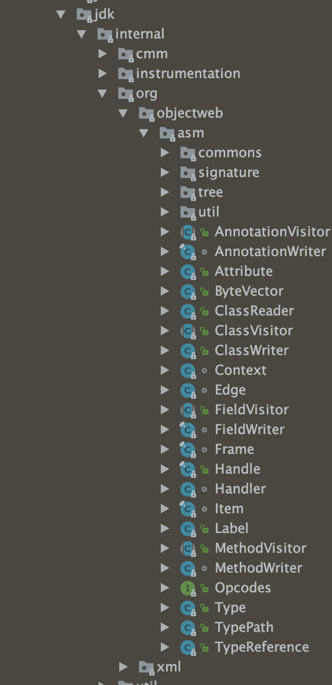

## ASM包结构
包结构


1. 类`jdk.internal.org.objectweb.asm.ClassReader`
```java
/**
 * A Java class parser to make a {@link ClassVisitor} visit an existing class.
 * This class parses a byte array conforming to the Java class file format and
 * calls the appropriate visit methods of a given class visitor for each field,
 * method and bytecode instruction encountered.
 *
 * @author Eric Bruneton
 * @author Eugene Kuleshov
 */
public class ClassReader {

```
2. 类`jdk.internal.org.objectweb.asm.ClassVisitor`
```java
/**
 * A visitor to visit a Java class. The methods of this class must be called in
 * the following order: <tt>visit</tt> [ <tt>visitSource</tt> ] [
 * <tt>visitOuterClass</tt> ] ( <tt>visitAnnotation</tt> |
 * <tt>visitTypeAnnotation</tt> | <tt>visitAttribute</tt> )* (
 * <tt>visitInnerClass</tt> | <tt>visitField</tt> | <tt>visitMethod</tt> )*
 * <tt>visitEnd</tt>.
 *
 * @author Eric Bruneton
 */
public abstract class ClassVisitor {
```
3. 类`jdk.internal.org.objectweb.asm.ClassWriter`
```java
/**
 * A {@link ClassVisitor} that generates classes in bytecode form. More
 * precisely this visitor generates a byte array conforming to the Java class
 * file format. It can be used alone, to generate a Java class "from scratch",
 * or with one or more {@link ClassReader ClassReader} and adapter class visitor
 * to generate a modified class from one or more existing Java classes.
 *
 * @author Eric Bruneton
 */
public class ClassWriter extends ClassVisitor {


```

