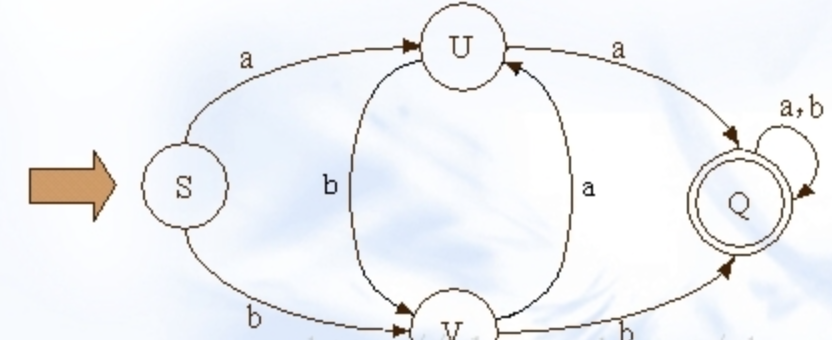
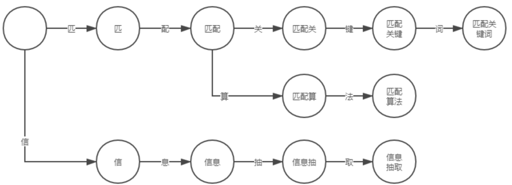
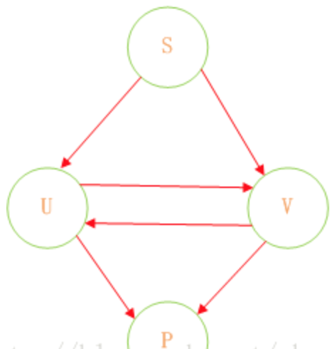
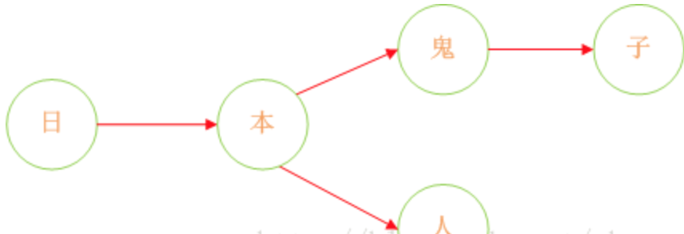
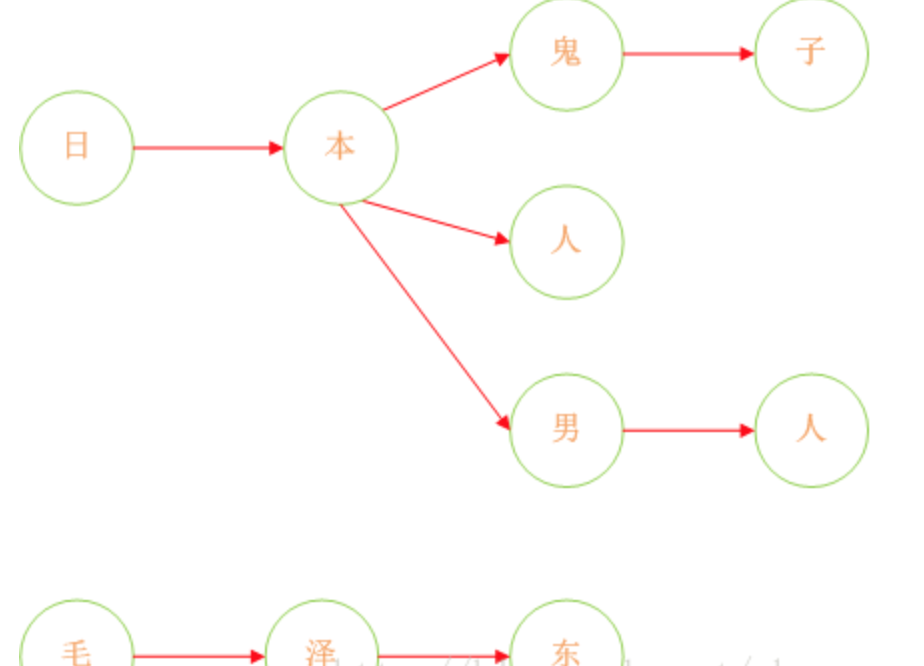
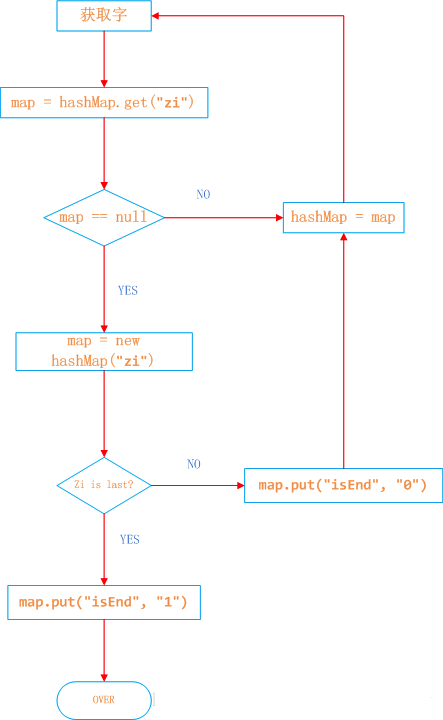
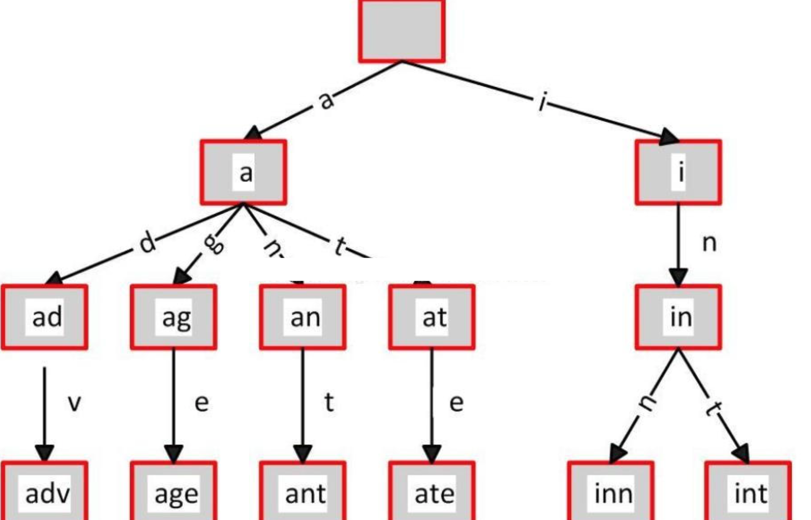

## 解答
 
## DFA算法简介 
 
在实现文字过滤的算法中，DFA是唯一比较好的实现算法。DFA即Deterministic Finite Automaton，也就是确定有穷自动机，它是是通过event和当前的state得到下一个state，即event+state=nextstate。下图展示了其状态的转换

DFA，全称 Deterministic Finite Automaton

即确定有穷自动机：从一个状态通过一系列的事件转换到另一个状态，即 state -> event
-> state。

确定：状态以及引起状态转换的事件都是可确定的，不存在“意外”。

有穷：状态以及事件的数量都是可穷举的。

我们可以将每个文本片段作为状态，例如“匹配关键词”可拆分为“匹”、“匹配”、“匹配关”、“匹配关键”和“匹配关键词”五个文本片段。

【过程】：

初始状态为空，当触发事件“匹”时转换到状态“匹”；

触发事件“配”，转换到状态“匹配”；

依次类推，直到转换为最后一个状态“匹配关键词”。

再让我们考虑多个关键词的情况，例如“匹配算法”、“匹配关键词”以及“信息抽取”。

在实现敏感词过滤的算法中，我们必须要减少运算，而DFA在DFA算法中几乎没有什么计算，有的只是状态的转换。

## Java实现DFA算法实现敏感词过滤

**测试方法**

    package algorithm.string.dfa;
     
    import java.util.HashSet;
    import java.util.List;
    import java.util.Set;
     
    public class Main {
     
        public static void main(String[] args) {
     
            Set<String> set=new HashSet<>();
            set.add("大中华");
            set.add("大中华帝国");
            set.add("大汉民族");
            set.add("日本人");
            set.add("日本鬼子");
            
            DFAUtil dfa=new DFAUtil();
            dfa.createDFAHashMap(set);
            Set<String> result=dfa.getSensitiveWordByDFAMap("大中华帝国和日本人",1);
            System.out.println("敏感词有"+result.size()+"个");
            for(String string:result){
                System.out.println("违背敏感词："+string);
            }
            
            
        }
     
    }

**创建DFAMap**

在Java中实现敏感词过滤的关键就是DFA算法的实现。首先我们对上图进行剖析。在这过程中我们认为下面这种结构会更加清晰明了。

同时这里没有状态转换，没有动作，有的只是Query（查找）。我们可以认为，通过S query U、V，通过U query V、P，通过V query U P。通过这样的转变我们可以将状态的转换转变为使用Java集合的查找。

诚然，加入在我们的敏感词库中存在如下几个敏感词：日本人、日本鬼子、毛.泽.东。那么我需要构建成一个什么样的结构呢？

首先：query 日 ---> {本}、query 本 --->{人、鬼子}、query 人 --->{null}、query 鬼 ---> {子}。形如下结构：

         下面我们在对这图进行扩展：

这样我们就将我们的敏感词库构建成了一个类似与一颗一颗的树，这样我们判断一个词是否为敏感词时就大大减少了检索的匹配范围。比如我们要判断日本人，根据第一个字我们就可以确认需要检索的是那棵树，然后再在这棵树中进行检索。

但是如何来判断一个敏感词已经结束了呢？利用标识位来判断。

所以对于这个关键是如何来构建一棵棵这样的敏感词树。下面我已Java中的HashMap为例来实现DFA算法。具体过程如下：

日本人，日本鬼子为例

1、在hashMap中查询“日”看其是否在hashMap中存在，如果不存在，则证明已“日”开头的敏感词还不存在，则我们直接构建这样的一棵树。跳至3。

2、如果在hashMap中查找到了，表明存在以“日”开头的敏感词，设置hashMap = hashMap.get("日")，跳至1，依次匹配“本”、“人”。

3、判断该字是否为该词中的最后一个字。若是表示敏感词结束，设置标志位isEnd = 1，否则设置标志位isEnd = 0；

程序实现如下：

注意：本文的编写和代码的编写参考了https://blog.csdn.net/chenssy/article/details/26961957

但是在代码上对它进行了改进，修复了几个bug

	/*{日=
	 * 	{本=
	 * 		{人={isEnd=1}, 
	 * 		鬼=
	 * 			{子={isEnd=1}, 
	 * 			isEnd=0}, 
	 * 		isEnd=0}, 
	 * 	isEnd=0}, 
	 * 
	 * 大=
	 * 	{汉=
	 * 		{民={isEnd=0, 
	 * 			族={isEnd=1}}, 
	 * 		isEnd=0}, 
	 * 	isEnd=0, 
	 * 	中={isEnd=0, 
	 * 		华={isEnd=1, 
	 * 			帝={isEnd=0, 
	 * 				国={isEnd=1}}}}}}*/
 
    /**set作为敏感词，创建出对应的dfa的Map，以供检验敏感词
	 * @param set
	 */
	public void createDFAHashMap(Set<String> set){
		HashMap<String, Object> nowMap;
		//根据set的大小，创建map的大小
		dfaMap=new HashMap<>(set.size());
		//对set里的字符串进行循环
		for(String key:set){
			//对每个字符串最初，nowMap就是dfaMap
			nowMap=dfaMap;			
			for(int i=0;i<key.length();i++){
				//一个个字符循环
				String nowChar=String.valueOf(key.charAt(i));
				//根据nowChar得到nowMap里面对应的value
				HashMap<String, Object> map=(HashMap<String, Object>)nowMap.get(nowChar);
				//如果map为空，则说明nowMap里面没有以nowChar开头的东西，则创建一个新的hashmap，
				//以nowChar为key，新的map为value，放入nowMap
				if(map==null){
					map=new HashMap<String,Object>();
					nowMap.put(nowChar, map);
				}		
				//nowMap=map，就是nowChar对应的对象
				nowMap=map;
				//最后在nowMap里设置isEnd
				//如果nowMap里面已经有isEnd，并且为1，说明以前已经有关键字了，就不再设置isEnd
				//因为如果没有这一步，大中华和大中华帝国，先设置大中华
				//在大中华帝国设置的时候，华对应的map有isEnd=1，如果这时对它覆盖，就会isEnd=0，导致大中华这个关键字失效
				if(nowMap.containsKey("isEnd")&&nowMap.get("isEnd").equals("1")){
					continue;
				}				
				if(i!=key.length()-1){
					nowMap.put("isEnd", "0");
				}
				else{
					nowMap.put("isEnd", "1");
				}								
			}						
		}
		System.out.println(dfaMap);
	}
	
得到的结果是

    {
      "日": {
        "本": {
          "人": {
            "isEnd": 1
          },
          "鬼": {
            "子": {
              "isEnd": 1
            },
            "isEnd": 0
          },
          "isEnd": 0
        },
        "isEnd": 0
      },
      "大": {
        "汉": {
          "民": {
            "isEnd": 0,
            "族": {
              "isEnd": 1
            }
          },
          "isEnd": 0
        },
        "isEnd": 0,
        "中": {
          "isEnd": 0,
          "华": {
            "isEnd": 1,
            "帝": {
              "isEnd": 0,
              "国": {
                "isEnd": 1
              }
            }
          }
        }
      }
    }

具体可以看上面的注释

**根据DFAMap进行检验**

敏感词库我们一个简单的方法给实现了，那么如何实现检索呢？检索过程无非就是hashMap的get实现，找到就证明该词为敏感词，否则不为敏感词。过程如下：假如我们匹配“中国人民万岁”。

1、第一个字“中”，我们在hashMap中可以找到。得到一个新的map = hashMap.get("")。

2、如果map == null，则不是敏感词。否则跳至3

3、获取map中的isEnd，通过isEnd是否等于1来判断该词是否为最后一个。如果isEnd == 1表示该词为敏感词，更新resultLength否则跳至1。

通过这个步骤我们可以判断“中国人民”为敏感词，但是如果我们输入“中国女人”则不是敏感词了。
 

    HashMap<String, Object> dfaMap;
	
	public static final int minMatchType=1;
	
	public static final int maxMatchType=2;
 
	/** 用创建的dfaMap，根据matchType检验字符串string是否包含敏感词，返回包含所有对于敏感词的set
	 * @param string 要检查是否有敏感词在内的字符串
	 * @param matchType 检查类型，如大中华帝国牛逼对应大中华和大中华帝国两个关键字，1为最小检查，会检查出大中华，2位最大，会检查出大中华帝国	
	 * @return
	 */
	public Set<String> getSensitiveWordByDFAMap(String string,int matchType){
		Set<String> set=new HashSet<>();
		for(int i=0;i<string.length();i++){
			//matchType是针对同一个begin的后面，在同一个begin匹配最长的还是最短的敏感词
			int length=getSensitiveLengthByDFAMap(string,i,matchType);
			if(length>0){
				set.add(string.substring(i,i+length));
				//这个对应的是一个敏感词内部的关键字（不包括首部），如果加上，大中华帝国，对应大中华和中华两个敏感词，只会对应大中华而不是两个
				//i=i+length-1;//减1的原因，是因为for会自增
			}
		}		
		return set;
	}
	
	/**如果存在，则返回敏感词字符的长度，不存在返回0
	 * @param string
	 * @param beginIndex
	 * @param matchType  1：最小匹配规则，2：最大匹配规则
	 * @return
	 */
	public int getSensitiveLengthByDFAMap(String string,int beginIndex,int matchType){
		//当前匹配的长度
		int nowLength=0;
		//最终匹配敏感词的长度，因为匹配规则2，如果大中华帝，对应大中华，大中华帝国，在华的时候，nowLength=3，因为是最后一个字，将nowLenth赋给resultLength
		//然后在帝的时候，now=4，result=3，然后不匹配，resultLength就是上一次最大匹配的敏感词的长度
		int resultLength=0;
		HashMap<String, Object> nowMap=dfaMap;
		for(int i=beginIndex;i<string.length();i++){
			String nowChar=String.valueOf(string.charAt(i));
			//根据nowChar得到对应的map，并赋值给nowMap
			nowMap=(HashMap<String, Object>)nowMap.get(nowChar);
			//nowMap里面没有这个char，说明不匹配，直接返回
			if(nowMap==null){
				break;
			}
			else{
				nowLength++;
				//如果现在是最后一个，更新resultLength
				if("1".equals(nowMap.get("isEnd"))){
					resultLength=nowLength;
					//如果匹配模式是最小，直接匹配到，退出
					//匹配模式是最大，则继续匹配，resultLength保留上一次匹配到的length
					if(matchType==minMatchType){
						break;
					}
				}
			}
		}		
		return resultLength;
	}
	
这里的改进是

取消了i的直接增加

    //这个对应的是一个敏感词内部的关键字（不包括首部），如果加上，大中华帝国，对应大中华和中华两个敏感词，只会对应大中华而不是两个
    //i=i+length-1;//减1的原因，是因为for会自增
加入了resultLength

    //最终匹配敏感词的长度，因为匹配规则2，如果大中华帝，对应大中华，大中华帝国，在华的时候，nowLength=3，因为是最后一个字，将nowLenth赋给resultLength
    //然后在帝的时候，now=4，result=3，然后不匹配，resultLength就是上一次最大匹配的敏感词的长度
    int resultLength=0;
    
这里面字符串为 大中华帝国和日本人

如果最小匹配，对应

敏感词有2个

- 违背敏感词：大中华
- 违背敏感词：日本人

最大匹配，对应

敏感词有2个

- 违背敏感词：大中华帝国
- 违背敏感词：日本人

完整代码

    package algorithm.string.dfa;
     
    import java.util.HashMap;
    import java.util.HashSet;
    import java.util.List;
    import java.util.Set;
     
    public class DFAUtil {
        
        HashMap<String, Object> dfaMap;
        
        public static final int minMatchType=1;
        
        public static final int maxMatchType=2;
        
        /*{日=
         * 	{本=
         * 		{人={isEnd=1}, 
         * 		鬼=
         * 			{子={isEnd=1}, 
         * 			isEnd=0}, 
         * 		isEnd=0}, 
         * 	isEnd=0}, 
         * 
         * 大=
         * 	{汉=
         * 		{民={isEnd=0, 
         * 			族={isEnd=1}}, 
         * 		isEnd=0}, 
         * 	isEnd=0, 
         * 	中={isEnd=0, 
         * 		华={isEnd=1, 
         * 			帝={isEnd=0, 
         * 				国={isEnd=1}}}}}}*/	
        /**set作为敏感词，创建出对应的dfa的Map，以供检验敏感词
         * @param set
         */
        public void createDFAHashMap(Set<String> set){
            HashMap<String, Object> nowMap;
            //根据set的大小，创建map的大小
            dfaMap=new HashMap<>(set.size());
            //对set里的字符串进行循环
            for(String key:set){
                //对每个字符串最初，nowMap就是dfaMap
                nowMap=dfaMap;			
                for(int i=0;i<key.length();i++){
                    //一个个字符循环
                    String nowChar=String.valueOf(key.charAt(i));
                    //根据nowChar得到nowMap里面对应的value
                    HashMap<String, Object> map=(HashMap<String, Object>)nowMap.get(nowChar);
                    //如果map为空，则说明nowMap里面没有以nowChar开头的东西，则创建一个新的hashmap，
                    //以nowChar为key，新的map为value，放入nowMap
                    if(map==null){
                        map=new HashMap<String,Object>();
                        nowMap.put(nowChar, map);
                    }		
                    //nowMap=map，就是nowChar对应的对象
                    nowMap=map;
                    //最后在nowMap里设置isEnd
                    //如果nowMap里面已经有isEnd，并且为1，说明以前已经有关键字了，就不再设置isEnd
                    //因为如果没有这一步，大中华和大中华帝国，先设置大中华
                    //在大中华帝国设置的时候，华对应的map有isEnd=1，如果这时对它覆盖，就会isEnd=0，导致大中华这个关键字失效
                    if(nowMap.containsKey("isEnd")&&nowMap.get("isEnd").equals("1")){
                        continue;
                    }				
                    if(i!=key.length()-1){
                        nowMap.put("isEnd", "0");
                    }
                    else{
                        nowMap.put("isEnd", "1");
                    }								
                }						
            }
            System.out.println(dfaMap);
        }
        
        
        /** 用创建的dfaMap，根据matchType检验字符串string是否包含敏感词，返回包含所有对于敏感词的set
         * @param string 要检查是否有敏感词在内的字符串
         * @param matchType 检查类型，如大中华帝国牛逼对应大中华和大中华帝国两个关键字，1为最小检查，会检查出大中华，2位最大，会检查出大中华帝国	
         * @return
         */
        public Set<String> getSensitiveWordByDFAMap(String string,int matchType){
            Set<String> set=new HashSet<>();
            for(int i=0;i<string.length();i++){
                //matchType是针对同一个begin的后面，在同一个begin匹配最长的还是最短的敏感词
                int length=getSensitiveLengthByDFAMap(string,i,matchType);
                if(length>0){
                    set.add(string.substring(i,i+length));
                    //这个对应的是一个敏感词内部的关键字（不包括首部），如果加上，大中华帝国，对应大中华和中华两个敏感词，只会对应大中华而不是两个
                    //i=i+length-1;//减1的原因，是因为for会自增
                }
            }		
            return set;
        }
        
        /**如果存在，则返回敏感词字符的长度，不存在返回0
         * @param string
         * @param beginIndex
         * @param matchType  1：最小匹配规则，2：最大匹配规则
         * @return
         */
        public int getSensitiveLengthByDFAMap(String string,int beginIndex,int matchType){
            //当前匹配的长度
            int nowLength=0;
            //最终匹配敏感词的长度，因为匹配规则2，如果大中华帝，对应大中华，大中华帝国，在华的时候，nowLength=3，因为是最后一个字，将nowLenth赋给resultLength
            //然后在帝的时候，now=4，result=3，然后不匹配，resultLength就是上一次最大匹配的敏感词的长度
            int resultLength=0;
            HashMap<String, Object> nowMap=dfaMap;
            for(int i=beginIndex;i<string.length();i++){
                String nowChar=String.valueOf(string.charAt(i));
                //根据nowChar得到对应的map，并赋值给nowMap
                nowMap=(HashMap<String, Object>)nowMap.get(nowChar);
                //nowMap里面没有这个char，说明不匹配，直接返回
                if(nowMap==null){
                    break;
                }
                else{
                    nowLength++;
                    //如果现在是最后一个，更新resultLength
                    if("1".equals(nowMap.get("isEnd"))){
                        resultLength=nowLength;
                        //如果匹配模式是最小，直接匹配到，退出
                        //匹配模式是最大，则继续匹配，resultLength保留上一次匹配到的length
                        if(matchType==minMatchType){
                            break;
                        }
                    }
                }
            }		
            return resultLength;
        }
    }

与前缀树的类似与不同

**类似**

思路类似，都是一个个节点，每个节点包含通往下一群节点的容器。

不同

**前缀树：**

这种java实现的下一个节点的容器是new TreeNode[26]，同时还有path（经过这个节点的数量），end（以这个节点结尾的数量），倾向于查找字符串的个数和前缀的个数

**dfa：**

java实现的容器是Map<String,Object>，没有path，只有key=isEnd，倾向于查询这个字符串中是否包含敏感词

其实两者本来是一个源头，只是为了不同的目的，从而node的构造不同

**复杂度**

n个敏感词，敏感词的平均长度是k，被查询字符串长度O(m)

时间复杂度  创建dfaMap，O(nk)，，查询是否有敏感词，O(mk)

空间复杂度  O(nk)

## Trie前缀树

## 前缀树的概述

前缀树又名字典树，单词查找树，Trie树，是一种多路树形结构，是哈希树的变种，和hash效率有一拼，是一种用于快速检索的多叉树结构。

典型应用是用于统计和排序大量的字符串（但不仅限于字符串），所以经常被搜索引擎系统用于文本词频统计。它的优点是：最大限度地减少无谓的字符串比较，查询效率比哈希表高。

Trie的核心思想是空间换时间。利用字符串的公共前缀来降低查询时间的开销以达到提高效率的目的。

Trie树也有它的缺点，Trie树的内存消耗非常大。

性质：不同字符串的相同前缀只保存一份。

操作：查找，插入，删除。

举个栗子：给出一组单词，inn, int, at, age, adv,ant, 我们可以得到下面的Trie：

从上面可以发现一些Trie树的特性：

1）根节点不包含字符，除根节点外的每一个子节点都包含一个字符。

2）从根节点到某一节点的路径上的字符连接起来，就是该节点对应的字符串。

3）每个节点的所有子节点包含的字符都不相同。

4）每条边对应一个字母。每个节点对应一项前缀。叶节点对应最长前缀，即单词本身。

单词inn与单词int有共同的前缀“in”, 因此他们共享左边的一条分支，root->i->in。同理，ate, age, adv, 和ant共享前缀"a"，所以他们共享从根节点到节点"a"的边。

查询操纵非常简单。比如要查找int，顺着路径i -> in -> int就找到了。

搭建Trie的基本算法也很简单，无非是逐一把每则单词的每个字母插入Trie。插入前先看前缀是否存在。如果存在，就共享，否则创建对应的节点和边。比如要插入单词add，就有下面几步：

考察前缀"a"，发现边a已经存在。于是顺着边a走到节点a。

考察剩下的字符串"dd"的前缀"d"，发现从节点a出发，已经有边d存在。于是顺着边d走到节点ad

考察最后一个字符"d"，这下从节点ad出发没有边d了，于是创建节点ad的子节点add，并把边ad->add标记为d。

**前缀树的应用场景**

**（1）字符串的快速检索**

字典树的查询时间复杂度是O(logL)，L是字符串的长度。所以效率还是比较高的。字典树的效率比hash表高。

hash表：

通过hash函数把所有的单词分别hash成key值，查询的时候直接通过hash函数即可，都知道hash表的效率是非常高的为O(1)，当然这是对于如果我们hash函数选取的好，计算量少，且冲突少，那单词查询速度肯定是非常快的。那如果hash函数的计算量相对大呢，且冲突律高呢？这些都是要考虑的因素。

还有就是hash表不支持动态查询，什么叫动态查询，当我们要查询单词apple时，hash表必须等待用户把单词apple输入完毕才能hash查询。当你输入到appl时肯定不可能hash吧。

字典树（tries树）：

对于单词查询这种，还是用字典树比较好，但也是有前提的，空间大小允许，字典树的空间相比较hash还是比较浪费的，毕竟hash可以用bit数组。

**（2）字符串排序**

从上图我们很容易看出单词是排序的，先遍历字母序在前面。

减少了没必要的公共子串。

**（3）最长公共前缀**

inn和int的最长公共前缀是in，遍历字典树到字母n时，此时这些单词的公共前缀是in。

**（4）自动匹配前缀显示后缀**

我们使用辞典或者是搜索引擎的时候，输入appl，后面会自动显示一堆前缀是appl的东东吧。

那么有可能是通过字典树实现的，前面也说了字典树可以找到公共前缀，我们只需要把剩余的后缀遍历显示出来即可。

 

**前缀树的java实现**

节点

    package datastructure.tree.trietree;
     
    import java.util.Arrays;
     
    public class TreeNode {
        
        //经过这个节点的字符串的个数（以这个节点为前缀的字符串的个数）
        public int path;
        //以这个节点结束的字符串的个数（有多少个字符串有这条路径的char组成）
        public int end;
        //对应着小写的a-z的26个字母（如果要更多可以使用hashmap<char,Node>
        public TreeNode[] next;
        
        public TreeNode(){
            path=0;
            end=0;
            next=new TreeNode[26];
        }
     
        @Override
        public String toString() {
            return "TreeNode [path=" + path + ", end=" + end + ", next=" + Arrays.toString(next) + "]";
        }
     
        
    }

**前缀树（增加，查询字符串数量，查询前缀数量）**

    package datastructure.tree.trietree;
     
    public class TrieTree {
        
        public TreeNode root;
        
        public TrieTree(){
            root=new TreeNode();
        }
        
     
        /**在前缀树中插入字符串
         * 这种++的方法，导致，一个node，有多少个end，就有多少个相同的字符串
         * 一个node，有多少个path，就有多少个字符串经过（root的path代表有多少个字符串）（字符串末尾的node的path也会++）
         * @param string 被插入的字符串（以前插入过的也可以插入）
         */
        public void insertString(String string){
            if(string==null||string.length()==0){
                return;
            }
            int length=string.length();
            TreeNode nowNode=root;
            for(int i=0;i<length;i++){
                char now=string.charAt(i);
                int index=now-'a';
                //index为字符now所处的位置
                if(nowNode.next[index]==null){
                    nowNode.next[index]=new TreeNode();
                }
                //先对当前node的path++，再转移到下一个node
                nowNode.path++;
                nowNode=nowNode.next[index];
                
            }
            //在最后的node，path和end++
            nowNode.path++;
            nowNode.end++;				
        }
        
     
        /**返回这个前缀树总共插入了多少个字符串
         * @return
         */
        public int size(){
            return root.path;
        }
        
        
        /**前缀树查询总共插入这个字符串多少次，如果没插入过，则返回0
         * @param string
         * @return
         */
        public int getStringNum(String string){
            if(string==null||string.length()==0){
                return 0;
            }
            int length=string.length();
            TreeNode nowNode=root;
            for(int i=0;i<length;i++){
                char now=string.charAt(i);
                int index=now-'a';
                //如果没有这个节点，说明不存在，直接返回0
                if(nowNode.next[index]==null){
                    return 0;
                }
                nowNode=nowNode.next[index];
            }		
            //此时nowNode已经处于最后一个节点
            return nowNode.end; 
        }
     
        /**前缀树查询以这个字符串为前缀的字符串总共多少个（包括以他为结尾的）
         * @param string 前缀
         * @return
         */
        public int getPrefixNum(String string){
            if(string==null||string.length()==0){
                return 0;
            }
            int length=string.length();
            TreeNode nowNode=root;
            for(int i=0;i<length;i++){
                char now=string.charAt(i);
                int index=now-'a';
                //如果没有这个节点，说明前缀不存在，直接返回0
                if(nowNode.next[index]==null){
                    return 0;
                }
                nowNode=nowNode.next[index];
            }		
            //此时nowNode已经处于前缀的最后一个节点
            return nowNode.path; 
        }
    }

测试

    package datastructure.tree.trietree;
     
    public class Main {
     
        public static void main(String[] args) {
            TrieTree tree=new TrieTree();
            tree.insertString("aa");
            tree.insertString("aa");
            tree.insertString("ab");
            tree.insertString("ba");
            //System.out.println(tree.root);
            //System.out.println(tree.size());
            //System.out.println(tree.getStringNum("aa"));
            //System.out.println(tree.getStringNum("ab"));
            //System.out.println(tree.getStringNum("ac"));
            System.out.println(tree.getPrefixNum("a"));
            System.out.println(tree.getPrefixNum("b"));
            System.out.println(tree.getPrefixNum("c"));
        }
     
    }

**与DFA查询敏感词的类似与不同**

**类似**

思路类似，都是一个个节点，每个节点包含通往下一群节点的容器。

**不同**

**前缀树：**

这种java实现的下一个节点的容器是new TreeNode[26]，同时还有path（经过这个节点的数量），end（以这个节点结尾的数量），倾向于查找字符串的个数和前缀的个数

**dfa：**

java实现的容器是Map<String,Object>，没有path，只有key=isEnd，倾向于查询这个字符串中是否包含敏感词

其实两者本来是一个源头，只是为了不同的目的，从而node的构造不同
