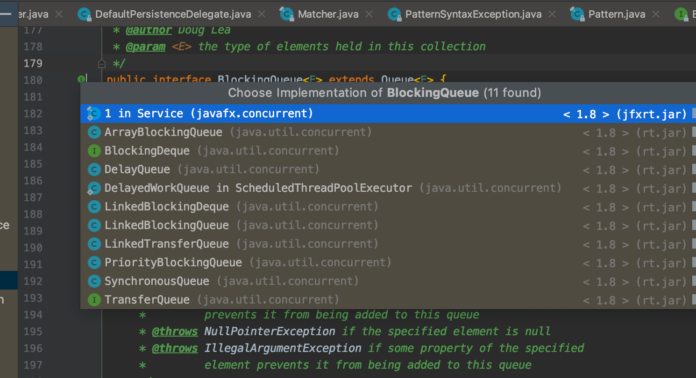

## 定义
1. 类的定义
```java
public interface BlockingQueue<E> extends Queue<E> {
    /**
     * Inserts the specified element into this queue if it is possible to do
     * so immediately without violating capacity restrictions, returning
     * {@code true} upon success and throwing an
     * {@code IllegalStateException} if no space is currently available.
     * When using a capacity-restricted queue, it is generally preferable to
     * use {@link #offer(Object) offer}.
     *
     * @param e the element to add
     * @return {@code true} (as specified by {@link Collection#add})
     * @throws IllegalStateException if the element cannot be added at this
     *         time due to capacity restrictions
     * @throws ClassCastException if the class of the specified element
     *         prevents it from being added to this queue
     * @throws NullPointerException if the specified element is null
     * @throws IllegalArgumentException if some property of the specified
     *         element prevents it from being added to this queue
     */
    boolean add(E e);

    /**
     * Inserts the specified element into this queue if it is possible to do
     * so immediately without violating capacity restrictions, returning
     * {@code true} upon success and {@code false} if no space is currently
     * available.  When using a capacity-restricted queue, this method is
     * generally preferable to {@link #add}, which can fail to insert an
     * element only by throwing an exception.
     *
     * @param e the element to add
     * @return {@code true} if the element was added to this queue, else
     *         {@code false}
     * @throws ClassCastException if the class of the specified element
     *         prevents it from being added to this queue
     * @throws NullPointerException if the specified element is null
     * @throws IllegalArgumentException if some property of the specified
     *         element prevents it from being added to this queue
     */
    boolean offer(E e);

    /**
     * Inserts the specified element into this queue, waiting if necessary
     * for space to become available.
     *
     * @param e the element to add
     * @throws InterruptedException if interrupted while waiting
     * @throws ClassCastException if the class of the specified element
     *         prevents it from being added to this queue
     * @throws NullPointerException if the specified element is null
     * @throws IllegalArgumentException if some property of the specified
     *         element prevents it from being added to this queue
     */
    void put(E e) throws InterruptedException;

    /**
     * Inserts the specified element into this queue, waiting up to the
     * specified wait time if necessary for space to become available.
     *
     * @param e the element to add
     * @param timeout how long to wait before giving up, in units of
     *        {@code unit}
     * @param unit a {@code TimeUnit} determining how to interpret the
     *        {@code timeout} parameter
     * @return {@code true} if successful, or {@code false} if
     *         the specified waiting time elapses before space is available
     * @throws InterruptedException if interrupted while waiting
     * @throws ClassCastException if the class of the specified element
     *         prevents it from being added to this queue
     * @throws NullPointerException if the specified element is null
     * @throws IllegalArgumentException if some property of the specified
     *         element prevents it from being added to this queue
     */
    boolean offer(E e, long timeout, TimeUnit unit)
        throws InterruptedException;

    /**
     * Retrieves and removes the head of this queue, waiting if necessary
     * until an element becomes available.
     *
     * @return the head of this queue
     * @throws InterruptedException if interrupted while waiting
     */
    E take() throws InterruptedException;

    /**
     * Retrieves and removes the head of this queue, waiting up to the
     * specified wait time if necessary for an element to become available.
     *
     * @param timeout how long to wait before giving up, in units of
     *        {@code unit}
     * @param unit a {@code TimeUnit} determining how to interpret the
     *        {@code timeout} parameter
     * @return the head of this queue, or {@code null} if the
     *         specified waiting time elapses before an element is available
     * @throws InterruptedException if interrupted while waiting
     */
    E poll(long timeout, TimeUnit unit)
        throws InterruptedException;

    /**
     * Returns the number of additional elements that this queue can ideally
     * (in the absence of memory or resource constraints) accept without
     * blocking, or {@code Integer.MAX_VALUE} if there is no intrinsic
     * limit.
     *
     * <p>Note that you <em>cannot</em> always tell if an attempt to insert
     * an element will succeed by inspecting {@code remainingCapacity}
     * because it may be the case that another thread is about to
     * insert or remove an element.
     *
     * @return the remaining capacity
     */
    int remainingCapacity();

    /**
     * Removes a single instance of the specified element from this queue,
     * if it is present.  More formally, removes an element {@code e} such
     * that {@code o.equals(e)}, if this queue contains one or more such
     * elements.
     * Returns {@code true} if this queue contained the specified element
     * (or equivalently, if this queue changed as a result of the call).
     *
     * @param o element to be removed from this queue, if present
     * @return {@code true} if this queue changed as a result of the call
     * @throws ClassCastException if the class of the specified element
     *         is incompatible with this queue
     *         (<a href="../Collection.html#optional-restrictions">optional</a>)
     * @throws NullPointerException if the specified element is null
     *         (<a href="../Collection.html#optional-restrictions">optional</a>)
     */
    boolean remove(Object o);

    /**
     * Returns {@code true} if this queue contains the specified element.
     * More formally, returns {@code true} if and only if this queue contains
     * at least one element {@code e} such that {@code o.equals(e)}.
     *
     * @param o object to be checked for containment in this queue
     * @return {@code true} if this queue contains the specified element
     * @throws ClassCastException if the class of the specified element
     *         is incompatible with this queue
     *         (<a href="../Collection.html#optional-restrictions">optional</a>)
     * @throws NullPointerException if the specified element is null
     *         (<a href="../Collection.html#optional-restrictions">optional</a>)
     */
    public boolean contains(Object o);

    /**
     * Removes all available elements from this queue and adds them
     * to the given collection.  This operation may be more
     * efficient than repeatedly polling this queue.  A failure
     * encountered while attempting to add elements to
     * collection {@code c} may result in elements being in neither,
     * either or both collections when the associated exception is
     * thrown.  Attempts to drain a queue to itself result in
     * {@code IllegalArgumentException}. Further, the behavior of
     * this operation is undefined if the specified collection is
     * modified while the operation is in progress.
     *
     * @param c the collection to transfer elements into
     * @return the number of elements transferred
     * @throws UnsupportedOperationException if addition of elements
     *         is not supported by the specified collection
     * @throws ClassCastException if the class of an element of this queue
     *         prevents it from being added to the specified collection
     * @throws NullPointerException if the specified collection is null
     * @throws IllegalArgumentException if the specified collection is this
     *         queue, or some property of an element of this queue prevents
     *         it from being added to the specified collection
     */
    int drainTo(Collection<? super E> c);

    /**
     * Removes at most the given number of available elements from
     * this queue and adds them to the given collection.  A failure
     * encountered while attempting to add elements to
     * collection {@code c} may result in elements being in neither,
     * either or both collections when the associated exception is
     * thrown.  Attempts to drain a queue to itself result in
     * {@code IllegalArgumentException}. Further, the behavior of
     * this operation is undefined if the specified collection is
     * modified while the operation is in progress.
     *
     * @param c the collection to transfer elements into
     * @param maxElements the maximum number of elements to transfer
     * @return the number of elements transferred
     * @throws UnsupportedOperationException if addition of elements
     *         is not supported by the specified collection
     * @throws ClassCastException if the class of an element of this queue
     *         prevents it from being added to the specified collection
     * @throws NullPointerException if the specified collection is null
     * @throws IllegalArgumentException if the specified collection is this
     *         queue, or some property of an element of this queue prevents
     *         it from being added to the specified collection
     */
    int drainTo(Collection<? super E> c, int maxElements);
}

```

## 成员变量

无


## 成员函数

一些增删元素的方法

## 内部类

无

## 子类



